```mermaid
flowchart TD
    subgraph Orchestrator["Orchestrator (service.ts)"]
        TICK[Poll Tick] --> RECONCILE[Reconcile Active Runs]
        RECONCILE --> LOAD_LEASES["Load leases.json"]
        LOAD_LEASES --> LOAD_RUNS["Load all runs<br/>(filter by projectId)"]
        LOAD_RUNS --> FOR_RUN{"For each active run"}

        FOR_RUN -->|process alive| UPDATE_RUN["Fetch live worker state<br/>Update run record<br/>(turnCount, tokens, executionPhase)"]
        FOR_RUN -->|process dead + retrying| CHECK_RETRY{"nextRetryAt > now?"}
        CHECK_RETRY -->|yes| SKIP_RETRY[Skip, wait]
        CHECK_RETRY -->|no| RESTART_RUN["restartRun()<br/>Mark old run as failed<br/>Create new RunRecord<br/>upsertLease()"]
        FOR_RUN -->|process dead + max attempts| FAIL_RUN["Mark run failed<br/>releaseLease()"]

        UPDATE_RUN --> FETCH_ISSUES
        SKIP_RETRY --> FETCH_ISSUES
        RESTART_RUN --> FETCH_ISSUES
        FAIL_RUN --> FETCH_ISSUES

        FETCH_ISSUES[Fetch issues from tracker] --> SYNC_STATES["syncActiveRunIssueStates()<br/>Update run.issueState"]
        SYNC_STATES --> RESOLVE["resolveActionableCandidates()"]
        RESOLVE --> FILTER_LEASED["Filter: no active lease"]
        FILTER_LEASED --> SORT["Sort: priority → createdAt → identifier"]
        SORT --> DISPATCH_LOOP{"For each candidate<br/>(while slots > 0)"}

        DISPATCH_LOOP --> START_RUN["startRun()"]
        START_RUN --> DERIVE_KEY["deriveIssueWorkspaceKey()<br/>SHA-256(projectId:adapter:subjectId)"]
        DERIVE_KEY --> ENSURE_WS["ensureIssueWorkspaceRepository()"]
        ENSURE_WS --> CHECK_WS{"Workspace exists?"}
        CHECK_WS -->|no| CREATE_WS["Create workspace dir<br/>saveIssueWorkspace()<br/>Run after_create hook"]
        CHECK_WS -->|yes| LOAD_WF
        CREATE_WS --> LOAD_WF["loadProjectWorkflow()"]
        LOAD_WF --> RENDER["renderPrompt()"]
        RENDER --> HOOK_BEFORE["Run before_run hook"]
        HOOK_BEFORE --> SPAWN["spawn worker process"]
        SPAWN --> UPSERT_LEASE["upsertLease(active)<br/>saveRun(status: running)"]

        UPSERT_LEASE --> SUPPRESS_CHECK["For each leased issue"]
        SUPPRESS_CHECK --> IS_ACTIONABLE{"Still actionable?"}
        IS_ACTIONABLE -->|no| SUPPRESS["Kill worker<br/>saveRun(suppressed)<br/>releaseLease()"]
        IS_ACTIONABLE -->|yes| TERMINAL_CHECK
        SUPPRESS --> TERMINAL_CHECK

        TERMINAL_CHECK["Clean terminal workspaces"] --> SAVE["saveProjectLeases()<br/>saveProjectStatus()"]
    end

    subgraph Worker["Worker (index.ts)"]
        W_START[Worker starts] --> W_PARSE["parseWorkflowMarkdown()"]
        W_PARSE --> W_PHASE["resolveInitialExecutionPhase()<br/>(planning | implementation)"]
        W_PHASE --> W_PLAN["prepareCodexRuntimePlan()"]
        W_PLAN --> W_LAUNCH["launchCodexAppServer()"]
        W_LAUNCH --> W_INIT["JSON-RPC: initialize"]
        W_INIT --> W_THREAD["JSON-RPC: thread/start"]
        W_THREAD --> W_TURN_LOOP{"Multi-turn loop<br/>(turn < maxTurns)"}

        W_TURN_LOOP --> W_TURN["JSON-RPC: turn/start"]
        W_TURN --> W_WAIT["waitForTurnWithTimeout()"]
        W_WAIT --> W_INPUT{"user_input_required?"}
        W_INPUT -->|yes| W_EXIT_FAIL["status: failed<br/>exit(1)"]
        W_INPUT -->|no| W_TRACKER["refreshTrackerState()"]
        W_TRACKER --> W_ACTIVE{"Issue active?"}
        W_ACTIVE -->|yes| W_TURN_LOOP
        W_ACTIVE -->|no| W_FINAL_PHASE["resolveFinalExecutionPhase()"]
        W_FINAL_PHASE --> W_EXIT_OK["status: completed<br/>exit(0)"]
    end

    subgraph Reconcile_Exit["Orchestrator: on worker exit"]
        EXIT[Worker process exits] --> READ_STATE["fetchWorkerRunInfo()<br/>(tokens, session, phase)"]
        READ_STATE --> MAX_ATT{"attempt >= maxAttempts?"}
        MAX_ATT -->|yes| FINAL_FAIL["saveRun(failed)<br/>releaseLease()"]
        MAX_ATT -->|no| CLASSIFY["classifyRetryKind()"]
        CLASSIFY -->|continuation| SCHED_CONT["nextRetryAt = now + 1s<br/>saveRun(retrying)"]
        CLASSIFY -->|failure| SCHED_FAIL["nextRetryAt = backoff<br/>saveRun(retrying)"]
    end

    SAVE -.->|next tick| TICK
    W_EXIT_OK --> EXIT
    W_EXIT_FAIL --> EXIT
```

# ADR: Issue-Centric State Model로 전환

- **Date**: 2026-03-16
- **Status**: Proposed
- **Related Issues**: Symphony Spec Sections 4.2, 7.1, 7.2
- **Related Spec**: `docs/symphony-spec.md`

## 요약

현재 구현은 **Run을 일급 엔티티**로 삼고 Lease 테이블로 issue 단위 중복 방지를 보조하는 구조이다.
Symphony 스펙은 **Issue를 일급 엔티티**로 삼고, issue당 명시적 orchestration state를 두며,
run attempt는 issue 하위의 종속 개념으로 정의한다.

이 ADR은 세 가지 연관된 편차를 하나의 아키텍처 전환으로 해소하는 방안을 제안한다:

1. **Workspace Key 도출 방식** (Section 4.2, 9.5)
2. **Issue Orchestration States** (Section 7.1)
3. **Run Attempt Lifecycle Phases** (Section 7.2)

---

## 1. 현재 상태 (Before)

### 1.1 데이터 모델

```
OrchestratorRunRecord (주체)
├── runId                    ← 기본 키
├── status: pending | starting | running | retrying | succeeded | failed | suppressed
├── executionPhase: planning | human-review | implementation | awaiting-merge | completed
├── issueId, issueIdentifier ← issue 참조 (역방향)
├── issueWorkspaceKey        ← SHA-256 해시 16자
└── processId, port, attempt, nextRetryAt, ...

ProjectLeaseRecord (보조)
├── leaseKey: issue.id       ← issue 단위 중복 방지
├── runId                    ← 현재 run 참조
├── status: active | released
└── updatedAt
```

**세 가지 키 체계가 공존:**

| 용도 | 키 | 도출 방식 |
|------|-----|----------|
| Run 식별 | `runId` | 타임스탬프 기반 생성 |
| Issue claim (lease) | `issue.id` (node ID) | GitHub API |
| Workspace 디렉토리 | SHA-256 16자 | `SHA-256(projectId:adapter:issueSubjectId)` |

### 1.2 상태 판별 방식

issue의 현재 orchestration state를 알려면 **lease + run을 교차 조회**해야 한다:

```typescript
// Unclaimed: lease가 없거나 released
!leases.some(l => l.leaseKey === key && l.status === "active")

// Claimed+Running: lease active + run.processId가 살아있음
lease.status === "active" && isProcessRunning(run.processId)

// RetryQueued: lease active + run.status === "retrying"
lease.status === "active" && run.status === "retrying" && run.nextRetryAt

// Released: lease.status === "released"
```

명시적 상태 필드가 없으므로 상태가 분산되어 있고, 판별 로직이 service.ts 전체에 퍼져 있다.

### 1.3 Run Attempt Phase vs Workflow Execution Phase

현재 `WorkflowExecutionPhase`는 tracker state에서 파생된 **워크플로우 수준** 개념이다:

```
planning → human-review → implementation → awaiting-merge → completed
```

스펙 7.2의 Run Attempt Phase는 **기술적 실행 단계**이다:

```
PreparingWorkspace → BuildingPrompt → LaunchingAgentProcess → InitializingSession
→ StreamingTurn → Finishing → Succeeded | Failed | TimedOut | Stalled | CanceledByReconciliation
```

이 둘은 **직교하는 개념**이지만, 현재 구현에는 스펙 7.2에 해당하는 기술적 실행 단계가 존재하지 않는다.

### 1.4 Before: 전체 흐름 (Tracker Polling → Terminate)



**문제점:**
- Run이 주체이므로 issue 상태를 알려면 lease + run을 모두 조회해야 함
- `executionPhase`가 워크플로우 단계(planning/implementation)만 추적, 기술적 단계(workspace 준비/프롬프트 빌드/스트리밍) 없음
- Workspace key가 해시여서 디렉토리 → issue 역추적 불가
- Retry 시 새 RunRecord를 생성하고 이전 run을 `failed`로 마킹 → run 이력이 복잡해짐

---

## 2. 제안 상태 (After)

### 2.1 데이터 모델

```
IssueOrchestrationRecord (주체)
├── issueId                  ← 기본 키 (node ID, 불변)
├── identifier               ← 사람 읽기용 ("acme/platform#123")
├── state: unclaimed | claimed | running | retry_queued | released
├── workspaceKey             ← identifier에서 도출 (사람이 읽을 수 있음)
├── currentRunId             ← running일 때 참조
├── retryEntry               ← retry_queued일 때 {attempt, dueAt, error}
└── updatedAt

OrchestratorRunRecord (종속, issue 하위)
├── runId                    ← 기본 키
├── issueId                  ← 소속 issue 참조
├── runPhase: preparing_workspace | building_prompt | streaming_turn | ... | failed
├── executionPhase           ← 유지 (GitHub 확장, 워크플로우 단계)
└── attempt, tokenUsage, ...
```

**키 체계 정리:**

| 용도 | 키 | 도출 방식 |
|------|-----|----------|
| Issue 식별 (내부) | `issue.id` (node ID) | GitHub API (불변) |
| Issue 식별 (표시) | `issue.identifier` | `"acme/platform#123"` |
| Workspace 디렉토리 | identifier 치환 | `acme_platform_123` (스펙 4.2) |
| Run 식별 | `runId` | 타임스탬프 기반 (변경 없음) |

### 2.2 상태 모델: 2-Layer

**Layer 1: Issue Orchestration State (스펙 7.1)**

issue 단위 claim 관리. 현재의 Lease 테이블을 대체한다.

```
Unclaimed ──→ Claimed ──→ Running ──→ RetryQueued ──→ Released
                │                         │
                └─────────────────────────┘
                          (retry dispatch)
```

| 전이 | 트리거 | 현재 구현 대응 |
|------|--------|---------------|
| Unclaimed → Claimed | dispatch 결정 | `upsertLease(active)` |
| Claimed → Running | worker spawn 성공 | `saveRun(running)` |
| Running → RetryQueued | worker exit | `saveRun(retrying)` |
| RetryQueued → Running | retry timer fired | `restartRun()` |
| Running → Released | terminal state / max attempts | `releaseLease()` |
| RetryQueued → Released | issue no longer eligible | `releaseLease()` |

**Layer 2: Run Attempt Phase (스펙 7.2)**

단일 run 실행의 기술적 진행 단계. **신규 추가.**

```
preparing_workspace → building_prompt → launching_agent → initializing_session
→ streaming_turn → finishing → succeeded
                                      ↘ failed
                                      ↘ timed_out
                                      ↘ stalled
                                      ↘ canceled_by_reconciliation
```

| Phase | 발생 시점 (코드 위치) |
|-------|---------------------|
| `preparing_workspace` | `ensureIssueWorkspaceRepository()` 진입 |
| `building_prompt` | `renderPrompt()` 진입 |
| `launching_agent` | `spawn()` 호출 |
| `initializing_session` | Worker: `initialize` JSON-RPC 전송 |
| `streaming_turn` | Worker: `turn/start` JSON-RPC 전송 |
| `finishing` | Worker: multi-turn loop 종료, 정리 중 |
| `succeeded` | Worker exit(0) |
| `failed` | Worker exit(non-zero) |
| `timed_out` | `waitForTurnWithTimeout()` 초과 |
| `stalled` | Orchestrator: stuck worker detection (30min) |
| `canceled_by_reconciliation` | Orchestrator: suppression |

**Layer 3: Workflow Execution Phase (GitHub 확장, 유지)**

tracker state에서 파생되는 워크플로우 수준 단계. 스펙에 없는 GitHub-specific 확장.

```
planning → human-review → implementation → awaiting-merge → completed
```

**세 레이어의 관계:**

```
Issue "acme/platform#42"
├── orchestrationState: running           ← Layer 1 (스펙 7.1)
├── workspaceKey: acme_platform_42        ← 스펙 4.2
│
└── Run "run-abc-123"
    ├── runPhase: streaming_turn          ← Layer 2 (스펙 7.2, 신규)
    └── executionPhase: implementation    ← Layer 3 (GitHub 확장, 유지)
```

### 2.3 Workspace Key 도출

**변경 전:**
```typescript
// identity.ts — SHA-256 해시
const input = [identity.projectId, identity.adapter, identity.issueSubjectId].join(":");
return createHash("sha256").update(input).digest("hex").slice(0, 16);
// 결과: "a1b2c3d4e5f6g7h8" (의미 불명)
```

**변경 후:**
```typescript
// identity.ts — 스펙 4.2 준수
export function deriveWorkspaceKey(identifier: string): string {
  return identifier.replace(/[^A-Za-z0-9._-]/g, "_");
}
// "acme/platform#123" → "acme_platform_123" (사람이 읽을 수 있음)
```

디렉토리 구조:
```
workspaces/<projectId>/issues/acme_platform_123/repository/
```

**Issue transfer 대응:**
- identifier가 바뀌면 workspace key도 바뀜 → 새 workspace 생성
- 이전 workspace는 cleanup 대상
- 드문 케이스이며, `after_create` hook이 새 workspace를 재구성

### 2.4 After: 전체 흐름 (Tracker Polling → Terminate)

```mermaid
flowchart TD
    subgraph Orchestrator["Orchestrator (service.ts)"]
        TICK[Poll Tick] --> RECONCILE[Reconcile Active Issues]
        RECONCILE --> LOAD_ISSUES_STATE["Load issues.json<br/>(IssueOrchestrationRecord[])"]
        LOAD_ISSUES_STATE --> FOR_ISSUE{"For each issue<br/>state = running | retry_queued"}

        FOR_ISSUE -->|state: running| CHECK_PROCESS{"Worker process alive?"}
        CHECK_PROCESS -->|alive + not stalled| POLL_WORKER["Fetch live worker state<br/>Update run.runPhase<br/>Update run.executionPhase<br/>Update tokens"]
        CHECK_PROCESS -->|alive + stalled| STALL["Kill worker<br/>run.runPhase = stalled<br/>issue.state → retry_queued"]
        CHECK_PROCESS -->|dead| ON_EXIT["fetchWorkerRunInfo()"]
        ON_EXIT --> MAX_ATT{"attempt >= maxAttempts?"}
        MAX_ATT -->|yes| RELEASE_FAIL["run.runPhase = failed<br/>issue.state → released"]
        MAX_ATT -->|no| CLASSIFY["classifyRetryKind()"]
        CLASSIFY -->|continuation| TO_RETRY_C["run.runPhase = succeeded<br/>issue.state → retry_queued<br/>retryEntry.dueAt = now + 1s"]
        CLASSIFY -->|failure| TO_RETRY_F["run.runPhase = failed<br/>issue.state → retry_queued<br/>retryEntry.dueAt = backoff"]

        FOR_ISSUE -->|state: retry_queued| CHECK_DUE{"retryEntry.dueAt <= now?"}
        CHECK_DUE -->|no| SKIP[Skip, wait]
        CHECK_DUE -->|yes| REDISPATCH["issue.state → claimed<br/>→ startRun() 진입"]

        POLL_WORKER --> FETCH_TRACKER
        STALL --> FETCH_TRACKER
        RELEASE_FAIL --> FETCH_TRACKER
        TO_RETRY_C --> FETCH_TRACKER
        TO_RETRY_F --> FETCH_TRACKER
        SKIP --> FETCH_TRACKER

        FETCH_TRACKER[Fetch issues from tracker] --> RESOLVE["resolveActionableCandidates()"]
        RESOLVE --> FILTER_UNCLAIMED["Filter: orchestrationState = unclaimed"]
        FILTER_UNCLAIMED --> SORT["Sort: priority → createdAt → identifier"]
        SORT --> DISPATCH_LOOP{"For each candidate<br/>(while slots > 0)"}

        DISPATCH_LOOP --> CLAIM["issue.state → claimed"]
        CLAIM --> START_RUN["startRun()"]
        START_RUN --> WS_PHASE["run.runPhase = preparing_workspace"]
        WS_PHASE --> DERIVE_KEY["deriveWorkspaceKey(identifier)<br/>replace non-alnum with _"]
        DERIVE_KEY --> ENSURE_WS["ensureIssueWorkspaceRepository()"]
        ENSURE_WS --> PROMPT_PHASE["run.runPhase = building_prompt"]
        PROMPT_PHASE --> RENDER["renderPrompt()"]
        RENDER --> HOOK_BEFORE["Run before_run hook"]
        HOOK_BEFORE --> LAUNCH_PHASE["run.runPhase = launching_agent"]
        LAUNCH_PHASE --> SPAWN["spawn worker process"]
        SPAWN --> TO_RUNNING["issue.state → running<br/>saveIssueOrchestration()<br/>saveRun()"]

        TO_RUNNING --> SUPPRESS_CHECK["For each running/retry_queued issue"]
        SUPPRESS_CHECK --> IS_ACTIONABLE{"Tracker: still actionable?"}
        IS_ACTIONABLE -->|no| CANCEL["Kill worker if running<br/>run.runPhase = canceled_by_reconciliation<br/>issue.state → released"]
        IS_ACTIONABLE -->|yes| TERMINAL_CHECK

        CANCEL --> TERMINAL_CHECK
        TERMINAL_CHECK["Clean released issue workspaces"] --> SAVE["saveIssueOrchestrations()<br/>saveProjectStatus()"]
    end

    subgraph Worker["Worker (index.ts)"]
        W_START[Worker starts] --> W_PARSE["parseWorkflowMarkdown()"]
        W_PARSE --> W_EXEC_PHASE["resolveInitialExecutionPhase()<br/>(planning | implementation)"]
        W_EXEC_PHASE --> W_PLAN["prepareCodexRuntimePlan()"]
        W_PLAN --> W_LAUNCH["launchCodexAppServer()"]
        W_LAUNCH --> W_INIT["run.runPhase → initializing_session<br/>JSON-RPC: initialize"]
        W_INIT --> W_THREAD["JSON-RPC: thread/start"]
        W_THREAD --> W_TURN_LOOP{"Multi-turn loop<br/>(turn < maxTurns)"}

        W_TURN_LOOP --> W_TURN["run.runPhase → streaming_turn<br/>JSON-RPC: turn/start"]
        W_TURN --> W_WAIT["waitForTurnWithTimeout()"]
        W_WAIT --> W_TIMEOUT{"Timeout?"}
        W_TIMEOUT -->|yes| W_TIMED_OUT["run.runPhase = timed_out<br/>exit(1)"]
        W_TIMEOUT -->|no| W_INPUT{"user_input_required?"}
        W_INPUT -->|yes| W_EXIT_FAIL["run.runPhase = failed<br/>exit(1)"]
        W_INPUT -->|no| W_TRACKER["refreshTrackerState()"]
        W_TRACKER --> W_ACTIVE{"Issue active?"}
        W_ACTIVE -->|yes| W_TURN_LOOP
        W_ACTIVE -->|no| W_FINISHING["run.runPhase → finishing<br/>resolveFinalExecutionPhase()"]
        W_FINISHING --> W_EXIT_OK["run.runPhase = succeeded<br/>exit(0)"]
    end

    SAVE -.->|next tick| TICK
    W_EXIT_OK --> ON_EXIT
    W_EXIT_FAIL --> ON_EXIT
    W_TIMED_OUT --> ON_EXIT
```



---

## 3. 변경 상세

### 3.1 신규 타입 정의

```typescript
// packages/core/src/contracts/issue-orchestration.ts (신규)

export type IssueOrchestrationState =
  | "unclaimed"
  | "claimed"
  | "running"
  | "retry_queued"
  | "released";

export type IssueOrchestrationRecord = {
  issueId: string;
  identifier: string;
  workspaceKey: string;
  state: IssueOrchestrationState;
  currentRunId: string | null;
  retryEntry: {
    attempt: number;
    dueAt: string;
    error: string | null;
  } | null;
  updatedAt: string;
};
```

```typescript
// packages/core/src/contracts/run-attempt-phase.ts (신규)

export const RUN_ATTEMPT_PHASES = [
  "preparing_workspace",
  "building_prompt",
  "launching_agent",
  "initializing_session",
  "streaming_turn",
  "finishing",
  "succeeded",
  "failed",
  "timed_out",
  "stalled",
  "canceled_by_reconciliation",
] as const;

export type RunAttemptPhase = (typeof RUN_ATTEMPT_PHASES)[number];
```

### 3.2 OrchestratorRunRecord 변경

```typescript
// packages/core/src/contracts/status-surface.ts

export type OrchestratorRunRecord = {
  // ... 기존 필드 유지
  runPhase: RunAttemptPhase;                       // 추가 (스펙 7.2)
  executionPhase: WorkflowExecutionPhase | null;   // 유지 (GitHub 확장)
};
```

### 3.3 Workspace Key 변경

```typescript
// packages/core/src/workspace/identity.ts

// 스펙 4.2: identifier에서 도출
export function deriveWorkspaceKey(identifier: string): string {
  return identifier.replace(/[^A-Za-z0-9._-]/g, "_");
}

// 마이그레이션 지원: 기존 SHA-256 방식
export function deriveIssueWorkspaceKeyLegacy(
  identity: IssueSubjectIdentity
): string {
  const input = [
    identity.projectId,
    identity.adapter,
    identity.issueSubjectId,
  ].join(":");
  return createHash("sha256").update(input).digest("hex").slice(0, 16);
}
```

### 3.4 Store 인터페이스 변경

```typescript
// packages/core/src/contracts/state-store.ts

export type OrchestratorStateStore = {
  // 기존 run 관련 메서드 유지
  saveRun(run: OrchestratorRunRecord): Promise<void>;
  loadRun(runId: string): Promise<OrchestratorRunRecord | null>;
  loadAllRuns(): Promise<OrchestratorRunRecord[]>;
  appendRunEvent(runId: string, event: OrchestratorEvent): Promise<void>;

  // Lease 메서드 → Issue Orchestration으로 교체
  // 제거: loadProjectLeases(), saveProjectLeases()
  // 추가:
  loadIssueOrchestrations(projectId: string): Promise<IssueOrchestrationRecord[]>;
  saveIssueOrchestration(record: IssueOrchestrationRecord): Promise<void>;
  saveIssueOrchestrations(projectId: string, records: IssueOrchestrationRecord[]): Promise<void>;

  // 기존 workspace/status 메서드 유지
};
```

### 3.5 파일시스템 레이아웃 변경

```
.runtime/orchestrator/
├── workspaces/<projectId>/
│   ├── issues.json                    ← leases.json 대체 (IssueOrchestrationRecord[])
│   ├── issues/
│   │   ├── acme_platform_42/          ← SHA-256 해시 대신 읽을 수 있는 키
│   │   │   └── repository/
│   │   └── acme_platform_43/
│   └── config.json
├── runs/<run-id>/
│   ├── run.json                       ← runPhase 필드 추가
│   ├── events.ndjson
│   └── workspace-runtime/
└── projects/<projectId>/status.json
```

---

## 4. 영향 범위

### 4.1 변경 대상 파일

| 파일 | 변경 내용 | 규모 |
|------|----------|------|
| `packages/core/src/contracts/issue-orchestration.ts` | **신규** — IssueOrchestrationRecord 타입 | Small |
| `packages/core/src/contracts/run-attempt-phase.ts` | **신규** — RunAttemptPhase 타입 | Small |
| `packages/core/src/contracts/status-surface.ts` | `OrchestratorRunRecord`에 `runPhase` 추가 | Small |
| `packages/core/src/contracts/state-store.ts` | lease → issue orchestration 메서드 교체 | Medium |
| `packages/core/src/workspace/identity.ts` | workspace key 도출 방식 변경 + legacy 유지 | Small |
| `packages/orchestrator/src/service.ts` | **핵심** — lease 로직 전면 교체, runPhase 전이 추가 | Large |
| `packages/orchestrator/src/fs-store.ts` | `leases.json` → `issues.json`, runPhase 저장 | Medium |
| `packages/worker/src/index.ts` | runPhase 전이 보고 (state API) | Medium |
| `packages/worker/src/state-server.ts` | `WorkerRuntimeState`에 `runPhase` 추가 | Small |
| `packages/worker/src/execution-phase.ts` | 유지 (WorkflowExecutionPhase 로직 변경 없음) | None |
| 테스트 파일 전체 | fixture 업데이트 | Medium |

### 4.2 변경하지 않는 것

- `WorkflowExecutionPhase` — GitHub 확장으로 유지
- `OrchestratorRunStatus` — run 최종 결과 (succeeded/failed 등) 유지
- Workspace safety invariants — 경로 탈출 방지 그대로
- Worker multi-turn protocol — JSON-RPC 흐름 변경 없음
- Hook 실행 로직 — after_create, before_run, after_run 그대로

### 4.3 마이그레이션 전략

**Workspace Key:**
- 새 issue는 스펙 방식 (identifier 치환)으로 생성
- 기존 workspace는 `IssueWorkspaceRecord.workspaceKey`로 탐색 (legacy 함수 유지)
- `loadIssueWorkspace()` 시 legacy key → 신규 key로 자동 마이그레이션

**Lease → Issue Orchestration:**
- 기존 `leases.json`에서 `issues.json`으로 변환하는 일회성 마이그레이션
- `lease.status === "active"` → 해당 run의 상태에 따라 `running` 또는 `retry_queued`
- `lease.status === "released"` → 레코드 제거 (unclaimed과 동일)

---

## 5. 결정 기록

### 선택한 방안

스펙 준수를 우선으로, Issue를 일급 엔티티로 전환한다.

### 대안: 현재 모델 유지 + 편의 함수 추가

Lease + Run 교차 조회를 감싸는 `getIssueOrchestrationState()` 헬퍼만 추가하는 방안.
장점은 변경 범위가 작지만, 스펙과의 모델 괴리가 계속 남고 HTTP API 구현 시 매번 변환이 필요하다.

### 대안: Workspace Key만 SHA-256 유지

Issue transfer 안전성을 위해 workspace key만 SHA-256을 유지하는 방안.
가능하지만, 스펙 4.2를 명시적으로 위반하며 디버깅 시 디렉토리 → issue 역추적이 불가하다.
GitHub에서 issue transfer는 드문 케이스이므로 스펙 준수의 가치가 더 크다고 판단했다.
