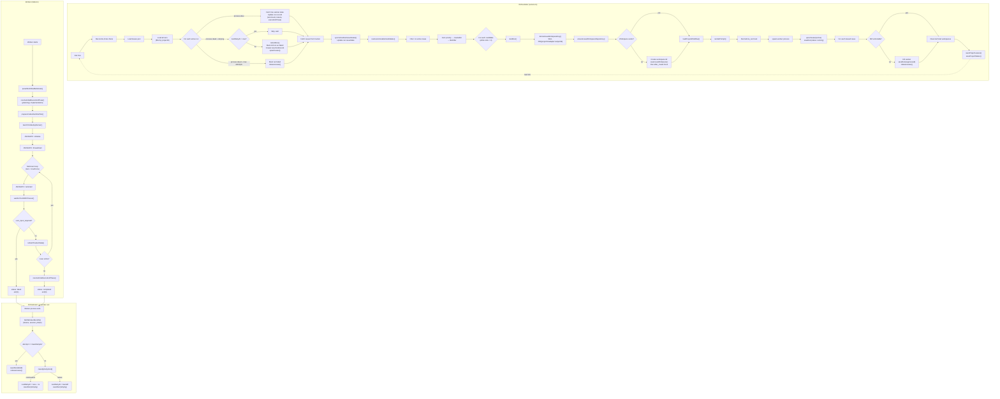
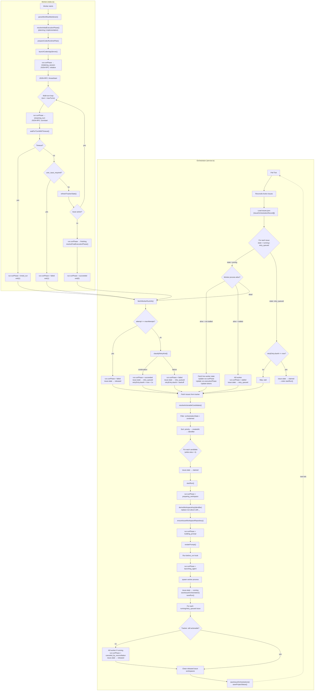

# ADR: Transition to an Issue-Centric State Model

- **Date**: 2026-03-16
- **Status**: Proposed
- **Related Issues**: Symphony Spec Sections 4.2, 7.1, 7.2
- **Related Spec**: `docs/symphony-spec.md`

## Summary

The current implementation treats the **Run as the first-class entity** and relies on a Lease table as an auxiliary mechanism to prevent duplicate work per issue.
The Symphony spec treats the **Issue as the first-class entity**, defines an explicit orchestration state per issue,
and defines run attempts as subordinate concepts under an issue.

This ADR proposes resolving three related divergences through a single architectural transition:

1. **Workspace key derivation** (Sections 4.2, 9.5)
2. **Issue orchestration states** (Section 7.1)
3. **Run attempt lifecycle phases** (Section 7.2)

---

## 1. Current State (Before)

### 1.1 Data Model

```
OrchestratorRunRecord (primary)
├── runId                    ← primary key
├── status: pending | starting | running | retrying | succeeded | failed | suppressed
├── executionPhase: planning | human-review | implementation | awaiting-merge | completed
├── issueId, issueIdentifier ← issue reference (reverse direction)
├── issueWorkspaceKey        ← 16-character SHA-256 hash
└── processId, port, attempt, nextRetryAt, ...

ProjectLeaseRecord (auxiliary)
├── leaseKey: issue.id       ← per-issue duplicate prevention
├── runId                    ← reference to the current run
├── status: active | released
└── updatedAt
```

**Three key schemes coexist:**

| Purpose             | Key                  | Derivation                                  |
| ------------------- | -------------------- | ------------------------------------------- |
| Run identification  | `runId`              | Timestamp-based generation                  |
| Issue claim (lease) | `issue.id` (node ID) | GitHub API                                  |
| Workspace directory | 16-character SHA-256 | `SHA-256(projectId:adapter:issueSubjectId)` |

### 1.2 State Determination

To know an issue's current orchestration state, you must **cross-reference the lease and the run**:

```typescript
// Unclaimed: no lease, or lease released
!leases.some((l) => l.leaseKey === key && l.status === "active");

// Claimed+Running: lease active + run.processId is alive
lease.status === "active" && isProcessRunning(run.processId);

// RetryQueued: lease active + run.status === "retrying"
lease.status === "active" && run.status === "retrying" && run.nextRetryAt;

// Released: lease.status === "released"
```

Because there is no explicit state field, the state is scattered, and the determination logic is spread across all of service.ts.

### 1.3 Run Attempt Phase vs Workflow Execution Phase

The current `WorkflowExecutionPhase` is a **workflow-level** concept derived from the tracker state:

```
planning → human-review → implementation → awaiting-merge → completed
```

The Run Attempt Phase in spec 7.2 is a **technical execution stage**:

```
PreparingWorkspace → BuildingPrompt → LaunchingAgentProcess → InitializingSession
→ StreamingTurn → Finishing → Succeeded | Failed | TimedOut | Stalled | CanceledByReconciliation
```

These two are **orthogonal concepts**, but the current implementation has no equivalent of the technical execution stages in spec 7.2.

### 1.4 Before: Full Flow (Tracker Polling → Terminate)


```mermaid
flowchart TD
    subgraph Orchestrator["Orchestrator (service.ts)"]
        TICK[Poll Tick] --> RECONCILE[Reconcile Active Runs]
        RECONCILE --> LOAD_LEASES["Load leases.json"]
        LOAD_LEASES --> LOAD_RUNS["Load all runs<br/>(filter by projectId)"]
        LOAD_RUNS --> FOR_RUN{"For each active run"}

        FOR_RUN -->|process alive| UPDATE_RUN["Fetch live worker state<br/>Update run record<br/>(turnCount, tokens, executionPhase)"]
        FOR_RUN -->|process dead + retrying| CHECK_RETRY{"nextRetryAt > now?"}
        CHECK_RETRY -->|yes| SKIP_RETRY[Skip, wait]
        CHECK_RETRY -->|no| RESTART_RUN["restartRun()<br/>Mark old run as failed<br/>Create new RunRecord<br/>upsertLease()"]
        FOR_RUN -->|process dead + max attempts| FAIL_RUN["Mark run failed<br/>releaseLease()"]

        UPDATE_RUN --> FETCH_ISSUES
        SKIP_RETRY --> FETCH_ISSUES
        RESTART_RUN --> FETCH_ISSUES
        FAIL_RUN --> FETCH_ISSUES

        FETCH_ISSUES[Fetch issues from tracker] --> SYNC_STATES["syncActiveRunIssueStates()<br/>Update run.issueState"]
        SYNC_STATES --> RESOLVE["resolveActionableCandidates()"]
        RESOLVE --> FILTER_LEASED["Filter: no active lease"]
        FILTER_LEASED --> SORT["Sort: priority → createdAt → identifier"]
        SORT --> DISPATCH_LOOP{"For each candidate<br/>(while slots > 0)"}

        DISPATCH_LOOP --> START_RUN["startRun()"]
        START_RUN --> DERIVE_KEY["deriveIssueWorkspaceKey()<br/>SHA-256(projectId:adapter:subjectId)"]
        DERIVE_KEY --> ENSURE_WS["ensureIssueWorkspaceRepository()"]
        ENSURE_WS --> CHECK_WS{"Workspace exists?"}
        CHECK_WS -->|no| CREATE_WS["Create workspace dir<br/>saveIssueWorkspace()<br/>Run after_create hook"]
        CHECK_WS -->|yes| LOAD_WF
        CREATE_WS --> LOAD_WF["loadProjectWorkflow()"]
        LOAD_WF --> RENDER["renderPrompt()"]
        RENDER --> HOOK_BEFORE["Run before_run hook"]
        HOOK_BEFORE --> SPAWN["spawn worker process"]
        SPAWN --> UPSERT_LEASE["upsertLease(active)<br/>saveRun(status: running)"]

        UPSERT_LEASE --> SUPPRESS_CHECK["For each leased issue"]
        SUPPRESS_CHECK --> IS_ACTIONABLE{"Still actionable?"}
        IS_ACTIONABLE -->|no| SUPPRESS["Kill worker<br/>saveRun(suppressed)<br/>releaseLease()"]
        IS_ACTIONABLE -->|yes| TERMINAL_CHECK
        SUPPRESS --> TERMINAL_CHECK

        TERMINAL_CHECK["Clean terminal workspaces"] --> SAVE["saveProjectLeases()<br/>saveProjectStatus()"]
    end

    subgraph Worker["Worker (index.ts)"]
        W_START[Worker starts] --> W_PARSE["parseWorkflowMarkdown()"]
        W_PARSE --> W_PHASE["resolveInitialExecutionPhase()<br/>(planning | implementation)"]
        W_PHASE --> W_PLAN["prepareCodexRuntimePlan()"]
        W_PLAN --> W_LAUNCH["launchCodexAppServer()"]
        W_LAUNCH --> W_INIT["JSON-RPC: initialize"]
        W_INIT --> W_THREAD["JSON-RPC: thread/start"]
        W_THREAD --> W_TURN_LOOP{"Multi-turn loop<br/>(turn < maxTurns)"}

        W_TURN_LOOP --> W_TURN["JSON-RPC: turn/start"]
        W_TURN --> W_WAIT["waitForTurnWithTimeout()"]
        W_WAIT --> W_INPUT{"user_input_required?"}
        W_INPUT -->|yes| W_EXIT_FAIL["status: failed<br/>exit(1)"]
        W_INPUT -->|no| W_TRACKER["refreshTrackerState()"]
        W_TRACKER --> W_ACTIVE{"Issue active?"}
        W_ACTIVE -->|yes| W_TURN_LOOP
        W_ACTIVE -->|no| W_FINAL_PHASE["resolveFinalExecutionPhase()"]
        W_FINAL_PHASE --> W_EXIT_OK["status: completed<br/>exit(0)"]
    end

    subgraph Reconcile_Exit["Orchestrator: on worker exit"]
        EXIT[Worker process exits] --> READ_STATE["fetchWorkerRunInfo()<br/>(tokens, session, phase)"]
        READ_STATE --> MAX_ATT{"attempt >= maxAttempts?"}
        MAX_ATT -->|yes| FINAL_FAIL["saveRun(failed)<br/>releaseLease()"]
        MAX_ATT -->|no| CLASSIFY["classifyRetryKind()"]
        CLASSIFY -->|continuation| SCHED_CONT["nextRetryAt = now + 1s<br/>saveRun(retrying)"]
        CLASSIFY -->|failure| SCHED_FAIL["nextRetryAt = backoff<br/>saveRun(retrying)"]
    end

    SAVE -.->|next tick| TICK
    W_EXIT_OK --> EXIT
    W_EXIT_FAIL --> EXIT
```

**Problems:**

- Because the Run is the primary entity, both the lease and the run must be queried to know an issue's state
- `executionPhase` only tracks workflow stages (planning/implementation); there are no technical stages (workspace preparation / prompt building / streaming)
- The workspace key is a hash, so a directory cannot be traced back to an issue
- On retry, a new RunRecord is created and the previous run is marked `failed` → run history becomes complicated

---

## 2. Proposed State (After)

### 2.1 Data Model

```
IssueOrchestrationRecord (primary)
├── issueId                  ← primary key (node ID, immutable)
├── identifier               ← human-readable ("acme/platform#123")
├── state: unclaimed | claimed | running | retry_queued | released
├── workspaceKey             ← derived from the identifier (human-readable)
├── currentRunId             ← referenced while running
├── retryEntry               ← {attempt, dueAt, error} while retry_queued
└── updatedAt

OrchestratorRunRecord (subordinate, under the issue)
├── runId                    ← primary key
├── issueId                  ← owning issue reference
├── runPhase: preparing_workspace | building_prompt | streaming_turn | ... | failed
├── executionPhase           ← retained (GitHub extension, workflow stage)
└── attempt, tokenUsage, ...
```

**Cleaned-up key scheme:**

| Purpose                         | Key                     | Derivation                     |
| ------------------------------- | ----------------------- | ------------------------------ |
| Issue identification (internal) | `issue.id` (node ID)    | GitHub API (immutable)         |
| Issue identification (display)  | `issue.identifier`      | `"acme/platform#123"`          |
| Workspace directory             | identifier substitution | `acme_platform_123` (spec 4.2) |
| Run identification              | `runId`                 | Timestamp-based (unchanged)    |

### 2.2 State Model: 2-Layer

**Layer 1: Issue Orchestration State (spec 7.1)**

Per-issue claim management. Replaces the current Lease table.

```
Unclaimed ──→ Claimed ──→ Running ──→ RetryQueued ──→ Released
                │                         │
                └─────────────────────────┘
                          (retry dispatch)
```

| Transition             | Trigger                       | Current implementation equivalent |
| ---------------------- | ----------------------------- | --------------------------------- |
| Unclaimed → Claimed    | dispatch decision             | `upsertLease(active)`             |
| Claimed → Running      | worker spawn succeeded        | `saveRun(running)`                |
| Running → RetryQueued  | worker exit                   | `saveRun(retrying)`               |
| RetryQueued → Running  | retry timer fired             | `restartRun()`                    |
| Running → Released     | terminal state / max attempts | `releaseLease()`                  |
| RetryQueued → Released | issue no longer eligible      | `releaseLease()`                  |

**Layer 2: Run Attempt Phase (spec 7.2)**

Technical progress stages of a single run execution. **Newly added.**

```
preparing_workspace → building_prompt → launching_agent → initializing_session
→ streaming_turn → finishing → succeeded
                                      ↘ failed
                                      ↘ timed_out
                                      ↘ stalled
                                      ↘ canceled_by_reconciliation
```

| Phase                        | When it occurs (code location)                |
| ---------------------------- | --------------------------------------------- |
| `preparing_workspace`        | Entering `ensureIssueWorkspaceRepository()`   |
| `building_prompt`            | Entering `renderPrompt()`                     |
| `launching_agent`            | `spawn()` call                                |
| `initializing_session`       | Worker: sends `initialize` JSON-RPC           |
| `streaming_turn`             | Worker: sends `turn/start` JSON-RPC           |
| `finishing`                  | Worker: multi-turn loop finished, cleaning up |
| `succeeded`                  | Worker exit(0)                                |
| `failed`                     | Worker exit(non-zero)                         |
| `timed_out`                  | `waitForTurnWithTimeout()` exceeded           |
| `stalled`                    | Orchestrator: stuck worker detection (30min)  |
| `canceled_by_reconciliation` | Orchestrator: suppression                     |

**Layer 3: Workflow Execution Phase (GitHub extension, retained)**

Workflow-level stages derived from the tracker state. A GitHub-specific extension not present in the spec.

```
planning → human-review → implementation → awaiting-merge → completed
```

**Relationship between the three layers:**

```
Issue "acme/platform#42"
├── orchestrationState: running           ← Layer 1 (spec 7.1)
├── workspaceKey: acme_platform_42        ← spec 4.2
│
└── Run "run-abc-123"
    ├── runPhase: streaming_turn          ← Layer 2 (spec 7.2, new)
    └── executionPhase: implementation    ← Layer 3 (GitHub extension, retained)
```

### 2.3 Workspace Key Derivation

**Before:**

```typescript
// identity.ts — SHA-256 hash
const input = [
  identity.projectId,
  identity.adapter,
  identity.issueSubjectId,
].join(":");
return createHash("sha256").update(input).digest("hex").slice(0, 16);
// Result: "a1b2c3d4e5f6g7h8" (meaning unknown)
```

**After:**

```typescript
// identity.ts — spec 4.2 compliant
export function deriveWorkspaceKey(identifier: string): string {
  return identifier.replace(/[^A-Za-z0-9._-]/g, "_");
}
// "acme/platform#123" → "acme_platform_123" (human-readable)
```

Directory structure:

```
workspaces/<projectId>/issues/acme_platform_123/repository/
```

**Handling issue transfers:**

- If the identifier changes, the workspace key changes too → a new workspace is created
- The previous workspace becomes a cleanup target
- This is a rare case, and the `after_create` hook rebuilds the new workspace

### 2.4 After: Full Flow (Tracker Polling → Terminate)


```mermaid
flowchart TD
    subgraph Orchestrator["Orchestrator (service.ts)"]
        TICK[Poll Tick] --> RECONCILE[Reconcile Active Issues]
        RECONCILE --> LOAD_ISSUES_STATE["Load issues.json<br/>(IssueOrchestrationRecord[])"]
        LOAD_ISSUES_STATE --> FOR_ISSUE{"For each issue<br/>state = running | retry_queued"}

        FOR_ISSUE -->|state: running| CHECK_PROCESS{"Worker process alive?"}
        CHECK_PROCESS -->|alive + not stalled| POLL_WORKER["Fetch live worker state<br/>Update run.runPhase<br/>Update run.executionPhase<br/>Update tokens"]
        CHECK_PROCESS -->|alive + stalled| STALL["Kill worker<br/>run.runPhase = stalled<br/>issue.state → retry_queued"]
        CHECK_PROCESS -->|dead| ON_EXIT["fetchWorkerRunInfo()"]
        ON_EXIT --> MAX_ATT{"attempt >= maxAttempts?"}
        MAX_ATT -->|yes| RELEASE_FAIL["run.runPhase = failed<br/>issue.state → released"]
        MAX_ATT -->|no| CLASSIFY["classifyRetryKind()"]
        CLASSIFY -->|continuation| TO_RETRY_C["run.runPhase = succeeded<br/>issue.state → retry_queued<br/>retryEntry.dueAt = now + 1s"]
        CLASSIFY -->|failure| TO_RETRY_F["run.runPhase = failed<br/>issue.state → retry_queued<br/>retryEntry.dueAt = backoff"]

        FOR_ISSUE -->|state: retry_queued| CHECK_DUE{"retryEntry.dueAt <= now?"}
        CHECK_DUE -->|no| SKIP[Skip, wait]
        CHECK_DUE -->|yes| REDISPATCH["issue.state → claimed<br/>→ enter startRun()"]

        POLL_WORKER --> FETCH_TRACKER
        STALL --> FETCH_TRACKER
        RELEASE_FAIL --> FETCH_TRACKER
        TO_RETRY_C --> FETCH_TRACKER
        TO_RETRY_F --> FETCH_TRACKER
        SKIP --> FETCH_TRACKER

        FETCH_TRACKER[Fetch issues from tracker] --> RESOLVE["resolveActionableCandidates()"]
        RESOLVE --> FILTER_UNCLAIMED["Filter: orchestrationState = unclaimed"]
        FILTER_UNCLAIMED --> SORT["Sort: priority → createdAt → identifier"]
        SORT --> DISPATCH_LOOP{"For each candidate<br/>(while slots > 0)"}

        DISPATCH_LOOP --> CLAIM["issue.state → claimed"]
        CLAIM --> START_RUN["startRun()"]
        START_RUN --> WS_PHASE["run.runPhase = preparing_workspace"]
        WS_PHASE --> DERIVE_KEY["deriveWorkspaceKey(identifier)<br/>replace non-alnum with _"]
        DERIVE_KEY --> ENSURE_WS["ensureIssueWorkspaceRepository()"]
        ENSURE_WS --> PROMPT_PHASE["run.runPhase = building_prompt"]
        PROMPT_PHASE --> RENDER["renderPrompt()"]
        RENDER --> HOOK_BEFORE["Run before_run hook"]
        HOOK_BEFORE --> LAUNCH_PHASE["run.runPhase = launching_agent"]
        LAUNCH_PHASE --> SPAWN["spawn worker process"]
        SPAWN --> TO_RUNNING["issue.state → running<br/>saveIssueOrchestration()<br/>saveRun()"]

        TO_RUNNING --> SUPPRESS_CHECK["For each running/retry_queued issue"]
        SUPPRESS_CHECK --> IS_ACTIONABLE{"Tracker: still actionable?"}
        IS_ACTIONABLE -->|no| CANCEL["Kill worker if running<br/>run.runPhase = canceled_by_reconciliation<br/>issue.state → released"]
        IS_ACTIONABLE -->|yes| TERMINAL_CHECK

        CANCEL --> TERMINAL_CHECK
        TERMINAL_CHECK["Clean released issue workspaces"] --> SAVE["saveIssueOrchestrations()<br/>saveProjectStatus()"]
    end

    subgraph Worker["Worker (index.ts)"]
        W_START[Worker starts] --> W_PARSE["parseWorkflowMarkdown()"]
        W_PARSE --> W_EXEC_PHASE["resolveInitialExecutionPhase()<br/>(planning | implementation)"]
        W_EXEC_PHASE --> W_PLAN["prepareCodexRuntimePlan()"]
        W_PLAN --> W_LAUNCH["launchCodexAppServer()"]
        W_LAUNCH --> W_INIT["run.runPhase → initializing_session<br/>JSON-RPC: initialize"]
        W_INIT --> W_THREAD["JSON-RPC: thread/start"]
        W_THREAD --> W_TURN_LOOP{"Multi-turn loop<br/>(turn < maxTurns)"}

        W_TURN_LOOP --> W_TURN["run.runPhase → streaming_turn<br/>JSON-RPC: turn/start"]
        W_TURN --> W_WAIT["waitForTurnWithTimeout()"]
        W_WAIT --> W_TIMEOUT{"Timeout?"}
        W_TIMEOUT -->|yes| W_TIMED_OUT["run.runPhase = timed_out<br/>exit(1)"]
        W_TIMEOUT -->|no| W_INPUT{"user_input_required?"}
        W_INPUT -->|yes| W_EXIT_FAIL["run.runPhase = failed<br/>exit(1)"]
        W_INPUT -->|no| W_TRACKER["refreshTrackerState()"]
        W_TRACKER --> W_ACTIVE{"Issue active?"}
        W_ACTIVE -->|yes| W_TURN_LOOP
        W_ACTIVE -->|no| W_FINISHING["run.runPhase → finishing<br/>resolveFinalExecutionPhase()"]
        W_FINISHING --> W_EXIT_OK["run.runPhase = succeeded<br/>exit(0)"]
    end

    SAVE -.->|next tick| TICK
    W_EXIT_OK --> ON_EXIT
    W_EXIT_FAIL --> ON_EXIT
    W_TIMED_OUT --> ON_EXIT
```

---

## 3. Change Details

### 3.1 New Type Definitions

```typescript
// packages/core/src/contracts/issue-orchestration.ts (new)

export type IssueOrchestrationState =
  | "unclaimed"
  | "claimed"
  | "running"
  | "retry_queued"
  | "released";

export type IssueOrchestrationRecord = {
  issueId: string;
  identifier: string;
  workspaceKey: string;
  state: IssueOrchestrationState;
  currentRunId: string | null;
  retryEntry: {
    attempt: number;
    dueAt: string;
    error: string | null;
  } | null;
  updatedAt: string;
};
```

```typescript
// packages/core/src/contracts/run-attempt-phase.ts (new)

export const RUN_ATTEMPT_PHASES = [
  "preparing_workspace",
  "building_prompt",
  "launching_agent",
  "initializing_session",
  "streaming_turn",
  "finishing",
  "succeeded",
  "failed",
  "timed_out",
  "stalled",
  "canceled_by_reconciliation",
] as const;

export type RunAttemptPhase = (typeof RUN_ATTEMPT_PHASES)[number];
```

### 3.2 OrchestratorRunRecord Changes

```typescript
// packages/core/src/contracts/status-surface.ts

export type OrchestratorRunRecord = {
  // ... existing fields retained
  runPhase: RunAttemptPhase; // added (spec 7.2)
  executionPhase: WorkflowExecutionPhase | null; // retained (GitHub extension)
};
```

### 3.3 Workspace Key Changes

```typescript
// packages/core/src/workspace/identity.ts

// Spec 4.2: derived from the identifier
export function deriveWorkspaceKey(identifier: string): string {
  return identifier.replace(/[^A-Za-z0-9._-]/g, "_");
}

// Migration support: existing SHA-256 approach
export function deriveIssueWorkspaceKeyLegacy(
  identity: IssueSubjectIdentity
): string {
  const input = [
    identity.projectId,
    identity.adapter,
    identity.issueSubjectId,
  ].join(":");
  return createHash("sha256").update(input).digest("hex").slice(0, 16);
}
```

### 3.4 Store Interface Changes

```typescript
// packages/core/src/contracts/state-store.ts

export type OrchestratorStateStore = {
  // Existing run-related methods retained
  saveRun(run: OrchestratorRunRecord): Promise<void>;
  loadRun(runId: string): Promise<OrchestratorRunRecord | null>;
  loadAllRuns(): Promise<OrchestratorRunRecord[]>;
  appendRunEvent(runId: string, event: OrchestratorEvent): Promise<void>;

  // Lease methods → replaced with Issue Orchestration
  // Removed: loadProjectLeases(), saveProjectLeases()
  // Added:
  loadIssueOrchestrations(
    projectId: string
  ): Promise<IssueOrchestrationRecord[]>;
  saveIssueOrchestration(record: IssueOrchestrationRecord): Promise<void>;
  saveIssueOrchestrations(
    projectId: string,
    records: IssueOrchestrationRecord[]
  ): Promise<void>;

  // Existing workspace/status methods retained
};
```

### 3.5 Filesystem Layout Changes

```
.runtime/orchestrator/
├── workspaces/<projectId>/
│   ├── issues.json                    ← replaces leases.json (IssueOrchestrationRecord[])
│   ├── issues/
│   │   ├── acme_platform_42/          ← readable key instead of a SHA-256 hash
│   │   │   └── repository/
│   │   └── acme_platform_43/
│   └── config.json
├── runs/<run-id>/
│   ├── run.json                       ← runPhase field added
│   ├── events.ndjson
│   └── workspace-runtime/
└── projects/<projectId>/status.json
```

---

## 4. Impact Scope

### 4.1 Files to Change

| File                                                 | Change                                                               | Size   |
| ---------------------------------------------------- | -------------------------------------------------------------------- | ------ |
| `packages/core/src/contracts/issue-orchestration.ts` | **New** — IssueOrchestrationRecord type                              | Small  |
| `packages/core/src/contracts/run-attempt-phase.ts`   | **New** — RunAttemptPhase type                                       | Small  |
| `packages/core/src/contracts/status-surface.ts`      | Add `runPhase` to `OrchestratorRunRecord`                            | Small  |
| `packages/core/src/contracts/state-store.ts`         | Replace lease methods with issue orchestration methods               | Medium |
| `packages/core/src/workspace/identity.ts`            | Change workspace key derivation + keep legacy                        | Small  |
| `packages/orchestrator/src/service.ts`               | **Core** — full replacement of lease logic, add runPhase transitions | Large  |
| `packages/orchestrator/src/fs-store.ts`              | `leases.json` → `issues.json`, persist runPhase                      | Medium |
| `packages/worker/src/index.ts`                       | Report runPhase transitions (state API)                              | Medium |
| `packages/worker/src/state-server.ts`                | Add `runPhase` to `WorkerRuntimeState`                               | Small  |
| `packages/worker/src/execution-phase.ts`             | Retained (no change to WorkflowExecutionPhase logic)                 | None   |
| All test files                                       | Fixture updates                                                      | Medium |

### 4.2 What Does Not Change

- `WorkflowExecutionPhase` — retained as a GitHub extension
- `OrchestratorRunStatus` — final run outcome (succeeded/failed etc.) retained
- Workspace safety invariants — path escape prevention unchanged
- Worker multi-turn protocol — JSON-RPC flow unchanged
- Hook execution logic — after_create, before_run, after_run unchanged

### 4.3 Migration Strategy

**Workspace Key:**

- New issues use the spec approach (identifier substitution)
- Existing workspaces are looked up via `IssueWorkspaceRecord.workspaceKey` (legacy function retained)
- On `loadIssueWorkspace()`, automatic migration from the legacy key to the new key

**Lease → Issue Orchestration:**

- One-time migration converting the existing `leases.json` to `issues.json`
- `lease.status === "active"` → `running` or `retry_queued` depending on the state of the corresponding run
- `lease.status === "released"` → record removed (equivalent to unclaimed)

---

## 5. Decision Record

### Chosen Option

Prioritize spec compliance and transition to the Issue as the first-class entity.

### Alternative: Keep the Current Model + Add Convenience Functions

Only add a `getIssueOrchestrationState()` helper that wraps the lease + run cross-lookup.
The advantage is a small change footprint, but the model divergence from the spec persists, and every HTTP API implementation would need to convert each time.

### Alternative: Keep SHA-256 Only for the Workspace Key

Keep SHA-256 only for the workspace key, for issue-transfer safety.
Feasible, but it explicitly violates spec 4.2 and makes directory-to-issue back-tracing impossible when debugging.
Since issue transfer is a rare case on GitHub, we judged spec compliance to be worth more.
