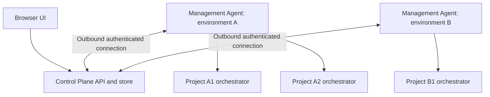

# Control Plane and environment management agents

- **Date:** 2026-10-04
- **Status:** Approved — operator approval and completion recorded in [#984](https://github.com/hojinzs/github-symphony/issues/984) on 2026-10-05; PR #982 merged. Earlier Draft/review-pending statements below describe the pre-approval snapshot.
- **Symphony Layers:** Configuration, Coordination, Integration, Observability; Execution at the host process lifecycle boundary
- **Scope:** Proposed architecture; this document does not describe shipped commands or APIs
- **Tracking:** [Epic #983](https://github.com/hojinzs/github-symphony/issues/983), [specification and usability child #984](https://github.com/hojinzs/github-symphony/issues/984), [delivery PR #982](https://github.com/hojinzs/github-symphony/pull/982)
- **Related documents:** [Standalone project boundary](../adr/2026-08-13_standalone-project-instance-boundary.md), [standalone project model](2026-08-11-standalone-project-model-design.md), [orchestrator extraction scope](2026-09-14-orchestrator-extraction-scope.md), [current control-plane package](../../packages/control-plane/README.md)
- **Visual redesign:** [C22 handoff and screen inventory](2026-10-05-ohmysymphony-c22-design-handoff.md), [Figma overview](https://www.figma.com/design/vUCdtVjmYMNWv7YYLRdo3e?node-id=23-368). This subsequent redesign remains pending its own operator review; archived decision samples remain source references.

## Intent and agreed scope

One operator manages existing Symphony projects on multiple machines through
one Control Plane UI. Each machine runs an installed Management Agent that
manages its local orchestrator processes. A project retains one orchestrator
instance and its existing workflow, tracker, workspace, and coding-agent behavior.

The agreed first-release constraints are:

- Existing, locally prepared project folders only.
- Installed agents and native host processes; no Docker management.
- One human operator, no user login, deployment within a private network.
- Agent identity and authentication are required independently of user login.
- Later releases add user authentication and OIDC, followed by the ability to
  operate on a public network under an explicitly reviewed deployment profile.
- Later project provisioning connects repositories and trackers, defines
  `WORKFLOW.md`, and registers skills through the UI.

The proposal supports macOS and Linux first. Windows support, fleet size targets,
and public deployment are outside this release's acceptance criteria.

## Upstream conformance and layer boundaries

Upstream [Symphony](../symphony-spec.md) sections 2.2 and 3 exclude a rich,
multi-tenant control plane from their prescribed scope. This management plane
is an explicit repository-local extension outside the single-workflow service.
It does not redefine the upstream specification.

| Layer         | Proposed responsibility                                          | Preserved boundary                                                                       |
| ------------- | ---------------------------------------------------------------- | ---------------------------------------------------------------------------------------- |
| Policy        | No first-release changes                                         | The local workflow defines coding and issue-handling policy                              |
| Configuration | Agent project allowlist, environment identity, protocol settings | Existing workflow loading, validation, and secret indirection remain authoritative       |
| Coordination  | Remote process lifecycle commands and their delivery records     | Each orchestrator exclusively owns dispatch, claims, retries, and reconciliation         |
| Execution     | Starting and stopping the host orchestrator process              | Workspace hooks and coding-agent execution remain inside the current runtime             |
| Integration   | Authenticated agent transport and local lifecycle adapter        | Tracker adapters remain local; the Control Plane does not call trackers to dispatch work |
| Observability | Aggregate snapshots, run history, log viewing, command audit     | Aggregate state is a projection of local observations, never scheduler state             |

The management plane stores operational metadata persistently. This does not
introduce a database requirement into the upstream orchestrator. No changes to
`docs/symphony-spec.md` are proposed. Existing repository-local runtime/API
divergences remain separate from this design.

## Architecture and authority



Management Agent means the host management daemon, not a coding agent.

| Component        | Owns                                                                                           | Does not own                                                                  |
| ---------------- | ---------------------------------------------------------------------------------------------- | ----------------------------------------------------------------------------- |
| Control Plane    | Environment registry, observed inventory, command records, audit records, UI                   | Tracker polling, issue dispatch, local project files, tracker/runtime secrets |
| Management Agent | Allowed folder inventory, authenticated transport, local command journal, process observations | Workflow policy, issue retry decisions, automatic relocation                  |
| Orchestrator     | Its single project's execution and scheduler state                                             | Other projects or environments                                                |

Project folders are the source of configuration. The Control Plane caches
non-secret inventory and status. The agent resolves local filesystem locations
and process identities. Orchestrators continue running when the agent or
Control Plane stops; reconnection observes existing processes without launching
replacements. Host reboot or an orchestrator crash does not automatically restart
projects in this release. The operator starts them explicitly.

The installed agent runs as the same ordinary OS user as its projects, with an
explicit Symphony CLI location and configuration directory. One agent manages
that user/configuration context on a machine. Separate users require separate
environment registrations. Agent shutdown must not signal managed orchestrators.
OS service packaging may restart the agent itself without changing this rule.

## Connection approaches

| Approach                                         | Advantages                                                         | Trade-offs                                                                   |
| ------------------------------------------------ | ------------------------------------------------------------------ | ---------------------------------------------------------------------------- |
| Agent-initiated HTTPS long polling — recommended | No inbound agent port; explicit, bounded request/response protocol | Requires durable delivery tracking and reconnect handling                    |
| Control Plane calls an inbound agent API         | Simple within a flat private network                               | Requires a reachable address and exposed listener for every environment      |
| SSH invokes the CLI                              | Small initial deployment footprint                                 | Mixes connection credentials, lifecycle commands, and continuous observation |

Use agent-initiated HTTPS long polling first. A reverse proxy may terminate TLS
for the Control Plane; agents validate its certificate, including a configured
private CA when needed. There is no generic reverse tunnel or remote shell.
WebSocket transport may replace long polling later without changing command
identity, completion, or observation semantics.

Proposed defaults: the agent posts observations every 5 seconds, and maintains
one command poll with a maximum 25-second wait. The Control Plane considers an
agent offline after 30 seconds without an authenticated heartbeat/observation.
These are management liveness intervals, independent of tracker polling.
An online agent may still have stale or unavailable project snapshots.

Reconnect uses exponential backoff with jitter, capped at 30 seconds. Only the
current inventory/status is resent after an outage; full snapshots are not
buffered indefinitely. Unacknowledged command results remain durable locally.

## Registration, identity, and project inventory

1. The operator opens Add environment from the Environments list and creates a
   named environment in a modal. The pending record is persisted immediately.
2. The Control Plane generates a single-use enrollment token, valid for 10 minutes.
3. The installed agent exchanges it for an environment-scoped credential over HTTPS.
4. The agent stores its identity and credential in a local file readable only by
   its OS user. The Control Plane stores a verifier, not the raw bearer credential.
5. The operator configures an explicit local allowlist of project folders.
6. The agent reports those folders, their validation results, and current runtime observations.

Token exchange alone does not mean connected. Enrollment moves the environment
from pending enrollment to enrolled / awaiting first signal. Only the first
authenticated heartbeat or observation from the current agent session changes
it to online. An online environment with zero projects is a successful connection,
not a failed enrollment. Project readiness is reported separately.

Enrollment consumption is atomic. Credential revocation blocks subsequent agent
requests without stopping local orchestrators. Re-enrollment replaces the old
credential; it does not silently attach a new machine to old project identities.
Only one active agent session is allowed per environment. A new session replaces
an expired session; a second session while the first is live is rejected. Local
agent configuration also has a single-process lock. A session ID and monotonic
observation sequence prevent old responses from replacing newer observations.

Environment IDs are generated by the Control Plane. Local project IDs use the
current CLI's folder-derived ID function with the registered canonical path.
The global key is
`(environmentId, localProjectId)`, since two machines can use the same folder
path and therefore the same local ID. Run and issue IDs are also qualified by
that global project key in aggregate routes.

Agent registration validates canonical paths and resolves symlinks using the
CLI's existing realpath-based process lock boundary. The current ID function
itself uses absolute-path normalization, not realpath, so existing runtimes
started through an alias may have a different cached ID. The adapter must resolve
those aliases through the existing registry and process lock, retain that runtime
ID for status/stop, and expose one aggregate project for the canonical folder.
It must not assume that hashing the canonical path finds every existing runtime.
Aliases for one folder cannot create two managed projects. Each operation
rechecks the registered canonical folder;
retargeting a symlink requires explicit local re-registration. Folder moves
create a new local project identity; migration is deferred.

The allowlist includes projects that have never been started. Local runtime
registries supplement observations but do not define which folders are managed.
A missing or invalid `WORKFLOW.md` marks the project unstartable while retaining
status/history and the ability to stop a verified existing process. Invalid
projects remain visible with a diagnostic. Removing a folder from the allowlist
removes new remote control without stopping its process; the cached UI entry
becomes unmanaged and remains available as historical metadata. Unclaimed
commands are rejected after removal. Already claimed operations may finish and
must retain their result history; removal cannot undo an effect in progress.

Inventory includes display name, global/local IDs, folder, CLI/protocol versions,
workflow revision when available, normalized non-secret tracker scope, and
validation status. It excludes workflow prompt contents, `.env` contents, MCP
secrets, and credential values. Unsupported versions appear in the UI but cannot
receive lifecycle commands.

## Local lifecycle adapter

Reuse the existing `project start --project-dir <path> --daemon`, status readers,
and graceful shutdown semantics behind a typed adapter. Remote stop requires the
expected-process entry point specified below; the existing folder-only
`project stop --project-dir <path>` is insufficient. Invoke
the configured executable with an argument array, never interpolated shell text.
Commands address registered project IDs; the Control Plane cannot supply an
arbitrary path, executable, environment override, or shell command.

First release exposes only `start` and `stop`. They mean ensure running and
ensure stopped at the time of completion, rather than continuously maintained
desired state. A start of a verified running project or stop of a verified stopped
project is successful without spawning or signaling anything. The agent serializes
lifecycle operations per project; different projects may operate concurrently.
Existing CLI locks also arbitrate with local CLI invocations.

Start retains current workflow validation and overlap checks and runs without
interactive input. Any required local remediation/confirmation fails with an
actionable diagnostic. The agent does not rewrite policy or resolve configuration
errors automatically. Start succeeds only after the orchestrator's readiness
signal and process ownership have been verified.

Stop uses the normal shutdown path, not force kill. The current CLI stop handler
sends `SIGTERM` and returns without waiting for exit; its output alone is not a
remote completion signal. The adapter waits for the verified target process to
exit and the project locks to release, and confirms that no replacement
orchestrator is running for the project. If that cannot be confirmed within 60
seconds, report an unresolved outcome and current observations. Do not
automatically escalate to `SIGKILL`. Stop can interrupt active coding work under
existing shutdown semantics; it is not a promise to drain all issues to completion.

Before a stop effect, the agent durably journals the canonical project folder,
runtime/configuration identity, PID and verified OS process identity of its
target. The local adapter must add an expected-target stop entry point, proposed
as `project stop --project-dir <path> --expected-pid <pid>
--expected-process-identity <identity>`. These options are a required future CLI
extension, not shipped flags. Both expected-target options must be supplied
together; the management agent never uses the folder-only fallback or `--force`.

This entry point compares the current project lock/daemon ownership, canonical
folder and OS process identity with the journaled target immediately before
signaling. It must not select a newly discovered daemon as a substitute. If A
has exited and local CLI startup has installed B, return `superseded_target`
without signaling B or deleting B's PID/lock records. If no orchestrator remains,
verified exit and released locks permit success; missing identity evidence yields
`process_unverified` without signaling. Recovery uses the same persisted target,
never a fresh folder-based stop. Platform signal-delivery race handling must be
verified in the local-adapter implementation; an agent-side queue alone does
not fence independent local CLI starts.

The adapter must exclude management credentials from subprocess environments
while retaining the existing project/runtime credential resolution behavior.
PID files alone are insufficient evidence: use existing process identity and
lock checks, including PID reuse handling. No generic process killer is added.

## Command delivery and recovery

Control Plane lifecycle submissions have an idempotency key. The durable record
contains command ID, global project key, operation, actor, session target,
submission/expiry timestamps, lifecycle state, and an optional diagnostic.
Reusing the same key with a different operation or target is a conflict.

```text
accepted -> executing -> succeeded | failed
accepted -> expired
executing -> unknown -> succeeded | failed
```

The Control Plane rejects new commands for offline, unmanaged, invalid-version,
or already-busy targets. There is at most one outstanding lifecycle command per
project; a conflicting click does not form a hidden queue. Accepted commands
expire if they have not been durably claimed within 30 seconds. The Control Plane deadline
is authoritative: after durably journaling receipt, the agent must claim the
command through the API before doing effects. The first claim atomically records
ownership and `claimedAt` and moves `accepted` to `executing`; it races expiry in
one store transaction. An unclaimed command cannot become `unknown`, including
on disconnect or service restart. Its first claim after expiry fails.

On receipt the agent durably records the command ID, target, and operation before
claiming execution. Duplicate delivery returns the existing journal state.
The claim API is idempotent for the command ID and enrolled-agent identity.
If a committed claim response is lost, the same agent's current owning session
can repeat it after the original 30-second claim deadline. Return the existing
state, ownership and original `claimedAt`; do not create another claim or reset
any deadline. Reject a stale session or different owner. A terminal, expired or
unknown command returns its existing state without authorizing new effects.
An `executing` response only confirms the original execution permission.

The agent durably records an effect-started marker before invoking the local
operation and serializes journal access per command. Claim replay or duplicate
delivery cannot invoke that operation again after the marker exists. If the
marker is absent and the original claim is still `executing`, a replayed response
allows the original operation to begin once. If the marker exists but completion
is missing, inspect evidence rather than replaying effects; a crash between the
marker and the actual operation is intentionally an unresolved recovery case.
Persisted execution ownership can be transferred to a reconnected session only
for the same enrolled agent and the same command ID, using the durable journal
to reconcile the original operation, not to issue a second execution permission.
Transfer fences the previous session and preserves the original claim time and
effect-started marker. Old sessions cannot claim
new commands or publish observations.

Once claimed, disconnection does not revoke execution. Commands may finish
locally while the Control Plane is unreachable. The agent stores the result
before publishing it and resends it until acknowledged. A command with a missing
execution/result report after a durable claim becomes `unknown`, never falsely
`failed` or `succeeded`. The 60-second execution observation timeout starts at
the original `claimedAt`; claim replay does not extend it or turn an unknown
command back into an executable one.
The UI prevents a replacement lifecycle command until recovery resolves the
previous record. This also applies after a 60-second execution observation timeout.

Agent restart reconciles journal entries using process identity, readiness/lock
evidence, and the persisted stop target. A stop must never signal a replacement
process just because the original PID or project is reused. A confirmed
replacement makes the interrupted stop unsuccessful, with a superseded-target
diagnostic; it does not authorize another signal. If evidence cannot
resolve an interrupted operation, leave it `unknown`; the operator explicitly
closes it as unresolved before submitting a new command. That closure is audited.
Recovery does not promise exactly-once execution. Durable deduplication, local
locks, and verified outcome reconciliation bound duplicate effects.

Control Plane restart preserves command/audit records and cached observations.
It marks environments offline until they reconnect, reconciles existing command
IDs, and does not replay expired work or generate replacement commands.

## Status, history, and logs

The UI represents these independent dimensions:

- Environment connection: online/offline, last contact, agent version.
- Project process: running/stopped/unknown, observation time, process identity
  only when appropriate for the operator view.
- Project health: the existing orchestrator health, freshness, and diagnostics.
- Work: active runs, retrying runs, bounded run history and issue details.
- Command: accepted/executing/succeeded/failed/expired/unknown.

Do not infer stopped from a disconnected agent or a stale snapshot. Missing
runtime data produces unavailable/unknown with a reason. Control Plane receipt
times determine connection freshness; agent observation timestamps are displayed
but are not trusted to extend liveness across clock skew.

Reuse the current filesystem-backed status/dashboard readers for local snapshots
and run records. Do not require each orchestrator's HTTP port to be exposed or
each project to run its own browser UI. Preserve current snapshot fields inside a
versioned management envelope; aggregate identifiers live outside that snapshot.

Run history and logs are fetched on demand through agent read requests. Such
requests use a separate, bounded read lane and never acquire the lifecycle command
slot. While offline, the UI shows cached status/history with timestamps and marks
uncached details/logs unavailable. The Control Plane does not persist raw logs
in the first release. It may retain at most 100 observed run summaries per project.

Log requests select registered project ID, run ID, and a fixed stream enum, not
an arbitrary filename. The agent verifies path containment and reads only the
selected local orchestrator/worker/event log. Each response is limited to 256 KiB,
with a file-generation/byte-offset cursor. Rotation or truncation returns an
explicit cursor reset. UI follow mode requests further chunks while visible and
stops on disconnect; it does not continuously upload every environment's logs.
Files and log text are rendered as text, never executable HTML. Existing secret
redaction applies to metadata, but arbitrary worker logs can contain sensitive
text; raw log viewing is restricted to the trusted operator access boundary.

## Storage and proposed interfaces

Use one Control Plane process with a local SQLite store for environment identity,
project projections, credentials' verifiers, command records, and audit records.
The concrete SQLite driver is an implementation-plan choice. Store the agent's
command journal and enrollment identity durably in its user-owned data directory.
No shared filesystem between machines is required. Control Plane backups contain
metadata, not project configuration or a recoverable copy of remote workspaces.

Proposed protocol contracts, not shipped API routes:

| Contract                   | Caller  | Purpose                                                      |
| -------------------------- | ------- | ------------------------------------------------------------ |
| Enrollment exchange        | Agent   | Consume one-use token and obtain environment credential      |
| Session open               | Agent   | Negotiate protocol version and establish exclusive session   |
| Observation upload         | Agent   | Send inventory, heartbeat, process observations, snapshots   |
| Command/read poll          | Agent   | Receive pending lifecycle and bounded read requests          |
| Execution claim            | Agent   | Atomically claim a non-expired command before effects        |
| Result upload              | Agent   | Publish durable command results or bounded read responses    |
| Environment/project query  | Browser | Read cached aggregate state and freshness                    |
| Lifecycle submission/query | Browser | Submit idempotent start/stop and inspect outcome             |
| Detail/log query           | Browser | Request local history or log chunks through the online agent |

All agent messages carry protocol version, environment/session identity, and
message or command ID. The initial major version is 1; incompatible majors are
rejected explicitly. Inventory advertises supported operations. Incoming message
sizes and pending read requests have fixed limits; oversized data produces a
diagnostic rather than an unbounded backlog. Exact route names and CLI commands
will be specified in the implementation plan, before code is written.

## Private deployment and future authentication

First release has no human login. The private listener/firewall boundary is the
human access boundary, and anyone able to access it acts as the local operator.
Bind to loopback by default; a private interface must be selected explicitly.
The frontend uses same-origin API requests. Mutations require the configured
UI origin and a session CSRF token; permissive CORS is not enabled. Agent routes
always require their enrollment/session credential and never accept browser actor
identity in place of agent authentication.

Every browser operation passes through an actor resolver returning `local-owner`
in this release. Audit events record actor, target, operation, command ID, time,
and outcome. No role hierarchy or multi-tenant schema is introduced now.

Future authentication maps a local user record to OIDC `(issuer, subject)`;
email is display metadata, not identity. The actor resolver can then enforce
authenticated API sessions without changing lifecycle commands or agent credentials.
Public exposure requires that authenticated profile, TLS, session handling, and
authorization to be implemented and tested together. OIDC alone does not authorize
arbitrary users of the identity provider. Agent credentials remain independent.

## Multiple environments and tracker ownership

Each managed project belongs to one environment. Automatic migration, failover,
global issue scheduling, and cross-host workspace sharing are out of scope.
Different projects on different machines must have disjoint issue pickup scopes.
The current CLI's overlap checks and project locks are local and cannot enforce
this across machines.

Report normalized non-secret tracker scope through adapter-owned metadata. The
Control Plane warns about identical reported scopes without reproducing
provider-specific issue eligibility rules. Unknown overlap is shown as unverified.
The operator must configure disjoint scopes before starting projects across
environments. This release makes no global exactly-once dispatch guarantee;
local CLI use and offline orchestrators can bypass aggregate observations.
A later global lease/scheduler design would be a separate Coordination change.

## UI and first-release acceptance

The UI has an environment list, aggregate project list, project detail with active
and retrying work plus recent runs, a bounded log viewer, and command history.
Projects can be filtered by environment and status. Start/stop show pending and
verified outcomes, and are disabled when connection or unresolved command state
prevents safe submission. A stop confirmation describes interruption of active
work. There is no arbitrary terminal, workflow editor, force kill, automatic
restart, project provisioning, or issue-level retry/cancel control.

Acceptance: one operator registers two installed agents, registers multiple
prepared projects across them, observes existing locally started orchestrators,
starts/stops projects remotely, and views local run history/logs in one UI.
Disconnecting either management component does not stop project execution and
does not produce false command completion or false stopped status.

## Delivery slices and future extension

1. **Local management adapter:** allowlist, inventory, typed lifecycle operations,
   durable journal, process reconciliation. No remote transport dependency.
2. **Management protocol and service:** enrollment, sessions, aggregate store,
   observation transport, command claims/results, bounded read requests.
3. **Aggregate UI:** environments/projects, runtime details, commands and logs;
   reuse suitable current components behind the aggregate API.
4. **Authentication:** user sessions and OIDC, authorization and public deployment
   verification. This is a separate release boundary.
5. **Provisioning:** agent capabilities for creating project folders, connecting
   repository/tracker declarations, workflow validation and skill registration.
   Locally created and UI-created projects use the same lifecycle adapter.

These are architectural slices, not an approved implementation plan. Do not turn
the current per-project `--web` server into a fleet server implicitly. Separate
the aggregate service from that shipped surface; a shared protocol module and
management-agent module are proposed package boundaries whose names will be
chosen in the implementation plan. The orchestrator must not depend on the agent
or aggregate service. Provisioning must preserve hook-owned repository population
and must not revive removed repository-cache or orchestrator cloning behavior.

## Test cases and validation

These behavioral TCs are implementation acceptance requirements. They have not
been executed against a management plane, which does not yet exist.

| TC    | Scenario                                                                                              | Expected result                                                                                                                                 |
| ----- | ----------------------------------------------------------------------------------------------------- | ----------------------------------------------------------------------------------------------------------------------------------------------- |
| CP-01 | Two environments report the same folder/local project ID                                              | Separate aggregate projects and correctly scoped operations                                                                                     |
| CP-02 | Register canonical folder and symlink alias                                                           | One project; a retargeted alias cannot redirect commands                                                                                        |
| CP-03 | Register unstarted or invalid workflow folder                                                         | Visible inventory; invalid start rejected, verified stop remains possible                                                                       |
| CP-04 | Concurrent local CLI and remote start, duplicate command delivery                                     | Existing lock retained; no second orchestrator; one command result                                                                              |
| CP-05 | Agent or Control Plane disconnects during active work                                                 | Orchestrator continues; UI retains explicitly stale observations                                                                                |
| CP-06 | Offline submission, unclaimed disconnect/expiry, claim-versus-expiry race                             | No offline backlog; unclaimed commands expire, never become unknown; atomic first claim permits effects only once                               |
| CP-07 | Command executes but result upload is lost; restart either side                                       | Durable result reconciled; no false failure or replacement command                                                                              |
| CP-08 | Stop returns before exit; target A exits and local CLI installs B before stop/recovery; PID reused    | Expected-target entry rejects B without a signal or deleting B's records; completion requires verified exit and released locks                  |
| CP-09 | Restart after effects with insufficient recovery evidence                                             | Unknown outcome shown; explicit audited closure needed for another command                                                                      |
| CP-10 | Clock skew, out-of-order observations, second agent session                                           | Receipt-based freshness, older observations ignored, live second session rejected                                                               |
| CP-11 | Reuse enrollment token, wrong environment credential, revocation                                      | Authentication rejected; local orchestrators remain running                                                                                     |
| CP-12 | Missing logs, traversal, rotation, large log, offline detail request                                  | Containment and size enforced; explicit reset/unavailable, no false empty success                                                               |
| CP-13 | Start needs interactive confirmation or remediation                                                   | Non-interactive failure with diagnostic; no policy rewrite                                                                                      |
| CP-14 | Project removed from allowlist or folder moved                                                        | Remote control revoked; process unaffected; no silent identity migration                                                                        |
| CP-15 | Agent launches CLI, submits inventory and status                                                      | Management credentials absent from child environment and uploaded metadata                                                                      |
| CP-16 | Private browser mutation from a foreign origin                                                        | Mutation rejected; valid local-owner operation is audited                                                                                       |
| CP-17 | Incompatible protocol or unresolved cross-environment tracker overlap                                 | Commands disabled for incompatible agent; overlap limitation visible                                                                            |
| CP-18 | Claim commits but response is lost; same owner retries after claim deadline                           | Original state/ownership/claimedAt returned; absent effect marker permits the original execution once; deadlines are not reset                  |
| CP-19 | Claim replay by stale session or another owner; replay after effect marker, terminal or unknown state | Stale/foreign ownership rejected; no second local invocation; terminal/unknown replay gives no effect permission                                |
| CP-20 | Create environment, close/reopen modal, expire/regenerate token and enroll without a heartbeat        | Pending record survives; old token is not recovered and regenerated token fences the previous one; exchange alone stays awaiting first signal   |
| CP-21 | Current session sends first authenticated heartbeat with empty inventory                              | Environment becomes online automatically; zero projects is successful connection, distinct from project readiness                               |
| CP-22 | Linux/macOS setup service installation fails after enrollment, then setup is retried                  | Saved identity resumes setup without another token; no duplicate agent or changed allowlist; absolute executable paths and user scope preserved |
| CP-23 | Start/restart/stop/uninstall user service; Linux linger absent; macOS logout/login                    | OS auto-start limits are explicit; agent lifecycle preserves orchestrators and journal; conflicting foreground process is rejected              |

During implementation, cover journal recovery, session fencing, identity,
timeouts, and log containment with deterministic unit tests. Verify the two-agent
acceptance path with stub workers and network fault injection. Docker may be used
as the repository's isolated test harness, but is not a deployment/runtime feature.
Add actual E2E scenarios to `AGENT_TEST.md` when implementing them.

For this documentation change, check scope and layer headers, agreed constraints,
relative links, failure contracts, and upstream immutability. Run the mandatory
repository `pnpm test` gate and report its actual result separately from the
future management-plane acceptance tests. Shipped CLI, package structure, and
runtime behavior remain unchanged, so their living references are not rewritten
to describe this proposal as current behavior.

## Review decisions

The scope constraints are agreed. This revision selects HTTPS long polling,
SQLite, the timing defaults above, bounded on-demand logs, explicit unresolved
command closure, and separate management packages as the version-1 design.
These choices are specification decisions, not claims of shipped behavior.
Written-spec and operator-flow review remain required before the Status changes
to Approved and implementation issues are promoted. Figma walkthrough evidence
must distinguish agent inspection from actual human usability validation.

## Version-1 implementation contracts

### Package and CLI boundaries

| Proposed package                   | Responsibility                                                                                 | CLI entry point             |
| ---------------------------------- | ---------------------------------------------------------------------------------------------- | --------------------------- |
| `@gh-symphony/management-protocol` | Versioned transport types, validation, errors and limits; no tracker or scheduler dependencies | None                        |
| `@gh-symphony/management-agent`    | Local allowlist, CLI adapter, journal, authenticated outbound client                           | `gh-symphony agent`         |
| `@gh-symphony/fleet-control-plane` | Aggregate API, SQLite records, agent sessions, browser assets                                  | `gh-symphony control-plane` |

The current `@gh-symphony/control-plane` per-project server retains its API and
CLI behavior. Reusable frontend components can be shared through a focused
follow-up boundary; neither fleet service nor agent becomes an orchestrator
dependency. The existing `@gh-symphony/cli` package owns one public executable,
`gh-symphony`, and routes the new command groups to the separate management
packages. The routing layer does not own transport, storage or lifecycle logic.
All commands target the repository's supported Node.js runtime and run as the
ordinary OS user that owns their local configuration. Installation, version
reporting and help use this shared CLI; standalone management executables are
not part of the first release. Existing `gh-symphony project` commands and the
per-project `--web` behavior are preserved.

Proposed Control Plane foreground entry point:

```text
gh-symphony control-plane run --config ./control-plane.yaml
```

Proposed first-release agent commands:

```text
gh-symphony agent setup --server https://symphony.lan
gh-symphony agent enroll --server https://symphony.lan
gh-symphony agent project add /srv/symphony/projects/backend
gh-symphony agent project list
gh-symphony agent project remove <local-project-id>
gh-symphony agent run
gh-symphony agent service install
gh-symphony agent service start
gh-symphony agent service stop
gh-symphony agent service restart
gh-symphony agent service status
gh-symphony agent service uninstall
```

Enrollment accepts the one-use token through an interactive hidden prompt or
`--token-stdin`, never a command-line token argument. A local config selects the
CLI executable, project config directory, private CA and agent data directory;
the server cannot change these host settings. `project add` only registers an
existing folder and does not create repositories or projects. `project remove`
revokes management but does not stop work. Agent configuration and journal are
under `~/.gh-symphony-agent/` by default, separate from orchestrator state.
`agent setup` is the guided connection entry point: check prerequisites, enroll
through the hidden token prompt, install the current user's native service and
start it. It reports each stage and the actual auto-start coverage. A partial
failure preserves enrolled identity so retry resumes service setup without
consuming another token. A second live agent is rejected by the existing lock;
setup must not replace another environment's identity or alter project allowlists.
The lower-level `enroll`, `service` and foreground `run` entries remain available
for recovery and diagnostics. Re-running service installation is idempotent for
the same user, executable and data directory; conflicting configuration requires
an explicit local repair. These commands manage only the agent, never managed
orchestrators. Uninstall removes the service definition but preserves identity,
project registrations and journal; credential revocation remains a separate action.

Both Linux and macOS use the same public commands. Linux uses a systemd user
service, enabled for the user manager and started immediately. Setup checks
whether systemd/user-session support is available and whether linger is enabled.
Boot startup and persistence after logout require linger; if absent, explain the
required `loginctl enable-linger` action and any local authorization requirement,
without silently elevating privileges. Unsupported Linux service managers use
the documented foreground path and are not reported as service-installed.
macOS uses a user-owned LaunchAgent under `~/Library/LaunchAgents`, loaded for
the current login session and configured to start again at user login. This is
not pre-login machine-boot startup and does not survive logout. Privileged
LaunchDaemons are outside v1. Both services resolve absolute Node/CLI/config
paths, restart the agent after unexpected exit with bounded backoff, and retain
user-readable diagnostics; credentials are not embedded in unit/plist arguments.
Foreground execution and services use the same single-process lock.

Service shutdown must preserve the existing agent/orchestrator lifetime boundary
at the OS level, not only in application signal handlers. Linux orchestration
processes must be outside the agent unit's stop/kill scope; detached spawning
alone does not leave a systemd control group. macOS managed processes must likewise
be outside the agent job's process-group cleanup. The implementation plan must
define and verify the concrete service/adapter isolation before service packaging
ships. CP-23 must stop/restart/uninstall the actual OS service while a remotely
started project is running and prove that project remains alive. Machine shutdown
or user-session teardown is not promised to preserve running projects.

These OS lifecycle distinctions follow the upstream platform documentation:
[systemd loginctl](https://www.freedesktop.org/software/systemd/man/252/loginctl.html)
and [Apple launchd jobs](https://developer.apple.com/library/archive/documentation/MacOSX/Conceptual/BPSystemStartup/Chapters/CreatingLaunchdJobs.html).
Service process-cleanup behavior is described in
[systemd.kill](https://www.freedesktop.org/software/systemd/man/latest/systemd.kill.html)
and [Apple launchd.plist](https://github.com/apple-oss-distributions/launchd/blob/main/man/launchd.plist.5).

The proposed `control-plane run` subcommand accepts an explicit private bind address, TLS
termination configuration and data directory, defaulting its backend to
`127.0.0.1:4690` and `~/.gh-symphony-control-plane/`. It must not silently select
another port on address conflict. The deployment defines one configured HTTPS
origin used by the browser and agents. Per-project `:4680` behavior is unaffected.

### Required installation and startup documentation

Epic #983 must include two dedicated documentation children when implementation
issues are registered after spec approval:

1. **README and CLI documentation update:** update `README.md` and
   `packages/cli/README.md` with installation, the shared command tree, help and
   version usage, and the distinction between local `project`, host `agent`, and
   aggregate `control-plane` commands. Keep existing local project usage valid.
2. **Control Plane installation and startup guide:** document supported Node.js
   prerequisites and package installation; the exact configuration schema and
   a runnable example; private bind/HTTPS origin, TLS/reverse proxy and private
   CA setup; data-directory permissions; foreground startup and initial UI
   access; environment modal, copyable setup instructions, native agent service
   installation/startup, local folder registration and recovery;
   health/readiness verification; shutdown, restart and common startup failures.
   Include persistence/backup guidance for SQLite and enrolled-agent identity.

The startup guide must demonstrate the sequence: install the shared CLI, configure
and start the Control Plane, open its UI, create an environment, enroll/start its
agent, register prepared folders and verify their inventory. Command examples
must be exercised against the implemented CLI in a clean environment before
these children are completed on both Linux and macOS. Include user service
status/stop/restart/uninstall, Linux linger and macOS login-start limitations.
Docker deployment, privileged system services and public-network/OIDC operation
remain outside that guide's first-release path. Exact configuration and installation instructions must be
specified before the feature is released; this draft command tree is not yet a
usable installation runbook. Documentation placement follows `docs/README.md`;
configuration details belong in `docs/configuration.md` with the guide linking
to them rather than defining a second conflicting schema.

### Identity and wire representation

Environment, session, global project, request, and command IDs are opaque UUIDs.
The global project record maps its UUID to `(environmentId, localProjectId)`
uniquely; browser routes use the UUID and never expose a composite path key as a
filesystem request. Alias runtime IDs are retained separately by the agent's
local adapter. Run IDs remain locally defined and qualified by global project ID.

All timestamps are UTC RFC3339 strings. Agent observation sequence is a
non-negative safe integer increasing within one session. Messages have
`protocolVersion: 1`, session ID and message/request ID. Never trust agent clocks
for credential expiry, execution claims or connection freshness.

An inventory upload is a complete allowlisted inventory revision. A project
observation has `projectId`, local ID, validation result, process observation,
`observedAt`, and optional redacted snapshot. A partial snapshot failure does not
delete the project. The agent reports the error and last successful snapshot
time; the UI retains that snapshot as stale. Runs uploaded as summaries preserve
their local timestamps and statuses. Neither missing snapshot nor an empty list
is proof of a stopped process.

### API surface

All routes below are proposed. Browser mutation routes require same-origin CSRF
protection and resolve the `local-owner` actor; agent routes require the
environment-scoped credential and session where applicable. Request bodies are
JSON; log bytes are UTF-8 text in a JSON result with an opaque cursor.

| Method and route                             | Contract                                                                                                                                                                 |
| -------------------------------------------- | ------------------------------------------------------------------------------------------------------------------------------------------------------------------------ |
| `POST /api/v1/environments`                  | Create named environment and return a one-use enrollment token once                                                                                                      |
| `GET /api/v1/environments`                   | Environment connection, version, inventory and last contact                                                                                                              |
| `POST /api/v1/environments/:id/enrollment`   | Regenerate a token for pending enrollment or explicit agent replacement                                                                                                  |
| `POST /api/v1/environments/:id/revoke`       | Revoke credential, expire unclaimed commands and mark management disconnected; do not stop projects                                                                      |
| `POST /api/v1/agents/enroll`                 | Atomically exchange token for credential and environment ID                                                                                                              |
| `POST /api/v1/agents/sessions`               | Negotiate version and exclusive session; reject a live second session                                                                                                    |
| `POST /api/v1/agents/observations`           | Validate sequence and persist current inventory/status projection                                                                                                        |
| `GET /api/v1/agents/poll`                    | Up to 25-second poll for session-owned commands/read requests                                                                                                            |
| `POST /api/v1/agents/commands/:id/claim`     | Atomically claim accepted command before expiry; same-owner replay returns original state/ownership after deadline without resetting it or authorizing duplicate effects |
| `POST /api/v1/agents/results`                | Idempotently acknowledge terminal command result or bounded read result                                                                                                  |
| `GET /api/v1/projects`                       | Paged aggregate projects; filter by environment, process state and connection                                                                                            |
| `GET /api/v1/projects/:id`                   | Process/health/freshness, last snapshot, active/retrying runs and diagnostics                                                                                            |
| `POST /api/v1/projects/:id/commands`         | Accept `start` or `stop` with `Idempotency-Key`; return durable command ID with HTTP 202                                                                                 |
| `GET /api/v1/commands/:id`                   | Durable command state, timestamps, evidence summary and diagnostic                                                                                                       |
| `POST /api/v1/commands/:id/close-unresolved` | Explicit operator acknowledgment plus reason; audit unresolved closure without rewriting it as success                                                                   |
| `GET /api/v1/projects/:id/commands`          | Paged command history including explicitly closed unknown outcomes                                                                                                       |
| `POST /api/v1/projects/:id/reads`            | Accept bounded `runs`, `run-detail` or `log-chunk` request while online                                                                                                  |
| `GET /api/v1/reads/:id`                      | Pending/completed/expired/unavailable read result                                                                                                                        |

Agent replacement requires revocation first; enrollment regeneration never
silently evicts a live agent. Expired enrollment tokens can be replaced without
changing environment ID. The UI presents replacement as a separate explicit
action and explains that old agent access ends while orchestrators continue.

API errors use `{ error: { code, message, requestId } }`. Stable codes include
`agent_offline`, `project_unmanaged`, `project_invalid`, `unsupported_protocol`,
`command_conflict`, `idempotency_conflict`, `command_expired`,
`unresolved_command`, `process_unverified`, `log_unavailable`, and
`cursor_reset`, `superseded_target`, and `claim_owner_conflict`. Authentication failures return 401; conflicting lifecycle/session
state returns 409; invalid input returns 400; revoked/unmanaged action scope
returns 403; missing entities return 404. Read expiry is represented as a read
result state, not silent empty content.

Idempotency keys are unique within browser actor scope. Retain command journal
deduplication records until the Control Plane acknowledges the result, then at
least 30 days. The Control Plane retains terminal command/audit records for 90
days by default and prunes only terminal or explicitly closed unknown records.
An unresolved record must never be pruned to unlock a project. A closed unknown
record keeps its `unknown` outcome plus `closedAt`, actor and reason; a new
operation gets a new command ID and fresh process checks.

### Capacity and observation limits

| Limit                     | Version-1 contract                                                                                                                   |
| ------------------------- | ------------------------------------------------------------------------------------------------------------------------------------ |
| Managed project inventory | Up to 100 folders per agent; larger inventories are rejected explicitly                                                              |
| Observation upload body   | 4 MiB; agent splits project snapshots across requests under one inventory revision                                                   |
| Lifecycle execution       | One active command per project, at most 4 concurrently per agent; excess capacity is rejected with `agent_busy`, not queued silently |
| Pending reads             | At most 4 per agent and 1 per project; additional reads return a busy diagnostic                                                     |
| Read lifetime             | 30 seconds; results held in Control Plane memory for 60 seconds after completion                                                     |
| Run summaries             | At most 100 cached summaries per project, newest first                                                                               |
| Log chunk                 | 256 KiB; requests do not include arbitrary paths                                                                                     |
| UI paging                 | Default 25 and maximum 100 rows                                                                                                      |

The Control Plane marks an agent offline after restart until a new authenticated
observation arrives. Nonterminal read requests are unavailable after service
restart and may be requested again; lifecycle command identity remains durable.
Known inventory revisions are committed only after all inventory pages arrive;
a partial revision cannot remove unseen projects. Per-project status updates can
still advance during a partial inventory upload.

## Operator experience contracts

The main navigation is Projects, Environments, and Commands. The private-network
and single-owner mode is visible in settings/context; no unavailable login,
project creation, Docker or failover controls are presented.

Projects is the default landing view. It separates environment connection from
project process and work state. The header's running count means freshly
confirmed running projects only; offline/stale projects have their own count and
are excluded from that current total. Rows show both observation time and
last-known process state when freshness is lost. State is communicated by text
and timestamps as well as color. All primary actions are keyboard focusable.

Environments has a dedicated list page reachable from primary navigation. Rows
show name, connection state, host/OS/version when known, project count and last
authenticated contact. Pending records appear without invented host metadata;
empty, pending, online, offline and revoked states have explicit text. Row actions
open connection instructions for pending records or the existing inventory view
for enrolled records. Add environment opens a centered modal over the list;
there is no separate full-page enrollment wizard.

The modal first asks only for the environment name. Create environment persists
the record and issues a ten-minute single-use token, then displays a Linux/macOS
selector, the configured HTTPS Control Plane origin, Copy setup command and Copy
token actions. No agent host/IP, inbound port or SSH key is required. The setup
instructions install the compatible shared CLI if needed, then invoke
`gh-symphony agent setup --server <configured-origin>`. The release's actual CLI
version and package installation method must be pinned and verified before
shipping; copied shell arguments are safely quoted. The command contains no
token: paste the copied token into the hidden terminal prompt. Installation
instructions identify prerequisites, current-user scope and OS auto-start limits.

The modal observes server state automatically: pending enrollment, enrolled /
awaiting first signal, then connected with host, OS, agent version and last
contact. No Refresh or second approval is required after successful setup. A
connected environment with zero projects offers the local `agent project add`
instructions and View environment. A successful credential exchange without a
heartbeat must not show connected. Waiting is not an indefinite progress spinner:
show elapsed time, token expiry and troubleshooting for token, TLS/private CA,
server reachability and service startup problems. The UI cannot infer a specific
host-side error when no signal reached the server.

Closing the modal keeps the environment and its waiting state in the list. The
token is visible/copyable only during the issuance session and is never restored
on reopen. Reopened pending records offer Regenerate token, which invalidates the
previous unused token while preserving the environment ID. After exchange, resume
instructions use the persisted agent identity instead of offering a new token.
Replacing an enrolled agent remains a separate explicit revocation flow.
Reconnection and pending enrollment are distinct states. Modal implementation
must trap focus, support Escape/close without deleting the record and return focus
to its trigger; asynchronous progress must be announced accessibly.
The UI never accepts an arbitrary remote folder path as a lifecycle target.

Project detail shows Connection, Process, Health, and Last observed independently.
It includes active/retrying work, recent runs, diagnostics and command history.
`Start` and `Stop` are per-project; no fleet-wide bulk mutation is included.
Disabled actions have an adjacent reason, not only a hover tooltip. A missing
workflow can block Start while verified Stop remains available.

Stop has a confirmation naming the project and environment and the observed
number of active runs, with the explicit warning that active coding work may be
interrupted. It offers Cancel and Stop project; no force-kill escalation. Accepted
commands display progress rather than optimistically flipping process state.
Command result and process observation remain separately timestamped.

Unknown command recovery shows the last verified evidence, reconnect guidance,
and the fact that the command may have executed. There is no Retry button. The
operator can close the outcome as unresolved with a required reason and a second
confirmation; this releases only the management command slot, not a scheduler
claim or host process lock. Afterward a fresh command still requires online state
and verified process checks.

Log viewing selects a known run and stream, displays chunk/follow state, and
announces rotation/truncation explicitly. Disconnection pauses follow and keeps
already fetched content visibly historical. A missing file or expired read is
an unavailable diagnostic, never an empty success. Run/history/log views do not
control issue retry, cancellation, tracker transitions or budgets.

Removing an environment from active management uses Revoke agent access rather
than Delete project. Its confirmation states that execution continues locally.
Local project allowlist removal becomes Unmanaged in the UI and revokes new
actions while preserving observed history. The UI gives host-side registration
instructions instead of implying that folder provisioning is supported.

### Screen inventory and walkthrough criteria

The Figma deliverable consists of editable desktop views at 1440px, preserving
the existing product's Inter UI typography, monospaced operational text and dark
surface treatment. Initial samples use the copied Tailwind gray palette; exact
alignment with the existing runtime palette belongs to the detailed design pass.
Component instances and auto-layout are required; whole-screen
raster images do not satisfy the deliverable. Each view has a named scenario and
prototype links to the relevant next view in the later interaction pass. The
initial deliverable below is a static screen set. Sample data is illustrative and must
never contain a real enrollment token or credential.

| Screen                         | Scenario                                                         | Required evidence                                                                                         |
| ------------------------------ | ---------------------------------------------------------------- | --------------------------------------------------------------------------------------------------------- |
| U01 — Fleet projects           | Locate running, stopped and offline projects across environments | Separate connection/process labels, observation age, per-project actions and stale count                  |
| U02 — Add environment modal    | Register, copy setup/token and await the first agent signal      | Name/create, OS selector, issuance/expiry, enrolled-but-waiting and connected/zero-project states         |
| U03 — Environment inventory    | Verify discovered folders or investigate invalid registration    | Online/last contact, inventory validation, unmanaged guidance and explicit revoke action                  |
| U04 — Project detail           | Inspect work and submit a lifecycle command                      | Independent connection/process/health, active/retry/recent work, command result and action reasons        |
| U05 — Stop confirmation        | Understand disruption before stopping one project                | Project/environment identity, active-run count, interruption copy and Cancel/Stop actions                 |
| U06 — Unknown command recovery | Resolve an ambiguous command outcome without blind replay        | Last evidence, no Retry, reconnection guidance, required-reason closure and explicit acknowledgment       |
| U07 — Run logs                 | Read and follow one known stream                                 | Run/stream selection, historical timestamps, bounded follow state and offline/unavailable/reset messaging |
| U08 — Environments list        | Find connected or pending hosts and open Add environment         | Host metadata only when known, separate project count, last contact and reopen-pending action             |

Walkthrough acceptance scenarios:

1. Enroll a machine, register two already prepared folders locally, and find both
   in the aggregate inventory without a UI project-creation flow.
2. Start a stopped project, observe its command progress, then verify running
   process state separately. Repeated submission does not suggest two starts.
3. Stop a project with active work, cancel the confirmation once, then confirm.
   The screen does not announce completion on signal delivery alone.
4. Disconnect a host containing a running project. Its last-known state is
   retained but fresh running totals exclude it, and mutations have a visible
   disabled reason.
5. Lose the result of a durably claimed command. Find the unknown outcome, inspect
   evidence, and acknowledge unresolved closure; no automatic Retry is offered.
6. Follow a log stream through rotation and disconnect. Content remains visible
   as historical and unavailable states cannot be mistaken for empty logs.
7. Remove a local allowlist entry or revoke agent access. The operator can tell
   that management ends while local execution continues.
8. Navigate all primary actions using keyboard focus and distinguish states
   without relying on color alone. These are implementation accessibility
   requirements; a static screenshot alone cannot prove keyboard behavior.
9. Create an environment from the list, copy setup/token and close the modal.
   Reopen without revealing the old token; regenerate an unused token, complete
   setup, observe enrolled / awaiting first signal, then connected with zero
   projects. Register folders afterward; enrollment success never depends on them.
10. Verify agent service start/restart/status/uninstall on Linux and macOS,
    including partial setup retry, foreground lock conflict, Linux linger missing
    and macOS logout/login. No agent service action stops local orchestrators.

Validation proceeds in three separately reported stages: editable-layer and
prototype-link inspection, rendered-screen inspection/model walkthrough, and
human review. Only the first two can be performed autonomously in this session.
The Figma artifact and scenario results are attached to #984 and PR #982 before
human review; absent evidence is reported as pending rather than passed.

### Initial Figma samples (2026-10-04)

The proposed product name **OhMySymphony** is used for design exploration only;
repository and package names are unchanged. The artifact is stored in the
[OhMySymphony folder in Dani Works](https://www.figma.com/files/team/987232692286731920/folder/665174118).

- [Editable screen review board](https://www.figma.com/design/vUCdtVjmYMNWv7YYLRdo3e?node-id=3-52).
- [Copied Official Tailwind CSS Styles library](https://www.figma.com/design/Bg9Hb0nSo97A4eNHqeApwk).
  This is a complete duplicate of the library in the Daniworks folder, moved
  into OhMySymphony: eight pages, 302 paint styles and 105 text styles. The
  duplicate is not newly published as a team library. The sample file copies the
  relevant palette/type definitions locally and adds scoped token aliases.
- Five local reusable components (metric, status, navigation item, field,
  project row), plus button instances from the existing team shadcn library.
  These are sample foundations, not a completed product design system.

| Screen | Figma sample                                                                                                                                                                      | Static evidence                                                                                                                                     | Remaining interaction/design validation                                                                         |
| ------ | --------------------------------------------------------------------------------------------------------------------------------------------------------------------------------- | --------------------------------------------------------------------------------------------------------------------------------------------------- | --------------------------------------------------------------------------------------------------------------- |
| U01    | [Fleet](https://www.figma.com/design/vUCdtVjmYMNWv7YYLRdo3e?node-id=4-593)                                                                                                        | Six projects across three environments; separate connection/process/work labels and age; historical offline state excluded from fresh-running count | Row actions, explicit stale filter/count, search and pagination behavior                                        |
| U02    | [Enrollment modal](https://www.figma.com/design/vUCdtVjmYMNWv7YYLRdo3e?node-id=4-683)                                                                                             | Updated to the 2026-10-05 list-backed waiting modal; shared CLI, OS selection and setup/token copy controls                                         | Actual clipboard, enrollment/service behavior, issuance/expiry and first-signal transitions                     |
| U03    | [Environment](https://www.figma.com/design/vUCdtVjmYMNWv7YYLRdo3e?node-id=4-728)                                                                                                  | Inventory, invalid workflow, contact age, local registration/removal guidance and revocation impact                                                 | Unmanaged row and explicit revocation confirmation                                                              |
| U04    | [Running detail](https://www.figma.com/design/vUCdtVjmYMNWv7YYLRdo3e?node-id=4-795), [verified stopped result](https://www.figma.com/design/vUCdtVjmYMNWv7YYLRdo3e?node-id=4-944) | Connection/process/work cards, active/retry/history, separate command result and verified-exit copy                                                 | Start/stop pending, rejected and expired states; adjacent disabled-action reasons; full diagnostics and history |
| U05    | [Stop confirmation](https://www.figma.com/design/vUCdtVjmYMNWv7YYLRdo3e?node-id=4-844)                                                                                            | Project/environment identity, active-run count, interruption warning and Cancel/Stop                                                                | Click-through cancel/confirm, focus behavior and asynchronous progress                                          |
| U06    | [Unknown result](https://www.figma.com/design/vUCdtVjmYMNWv7YYLRdo3e?node-id=4-873)                                                                                               | Claimed-command timeline, no Retry action, local inspection, resolution note and acknowledgment                                                     | Required-field validation, separate closure confirmation and closed-unresolved audit state                      |
| U07    | [Logs](https://www.figma.com/design/vUCdtVjmYMNWv7YYLRdo3e?node-id=4-908)                                                                                                         | Named run/streams, retained chunk with timestamps, disconnected follow and rotation messaging                                                       | Loading, missing-file/expired-read states, actual stream selection/follow/reset                                 |

Structural inspection found 423 editable descendants in the review board:
79 frames, 265 text nodes and 79 component instances; no image-filled nodes and
no font-family mismatches (Inter / JetBrains Mono). The nine review panels are
1440 × 1120: seven primary screen types, a stopped-result example and a review
checklist. Render inspection identified clipped multiline text and excessive
fleet spacing; these were repaired, and all panels' content bounds fit afterward.

This is a static model review of synthetic states. No prototype links, live
command behavior, keyboard accessibility, or operator usability test has passed.
The board records six walkthrough prompts and the next detailed design tasks.
The walkthrough acceptance scenarios above, human review and design
approval remain pending. This evidence does not approve the spec or close #984.
The initial full-page enrollment sample is superseded by the 2026-10-05 list and
modal revision below, including the shared `gh-symphony agent` command surface.

### Environment connection revision (2026-10-05)

The [environment connection review board](https://www.figma.com/design/vUCdtVjmYMNWv7YYLRdo3e?node-id=13-154)
adds a dedicated list and five list-backed modal states:

| Sample | Figma view                                                                                     | Static evidence                                                                                                   |
| ------ | ---------------------------------------------------------------------------------------------- | ----------------------------------------------------------------------------------------------------------------- |
| U08    | [Environments list](https://www.figma.com/design/vUCdtVjmYMNWv7YYLRdo3e?node-id=13-156)        | Online/offline/pending rows, contact age, zero-project connected host and connection instructions                 |
| U02a   | [Create modal](https://www.figma.com/design/vUCdtVjmYMNWv7YYLRdo3e?node-id=13-157)             | Name-only creation over the environment list; no agent IP/port                                                    |
| U02b   | [Linux waiting modal](https://www.figma.com/design/vUCdtVjmYMNWv7YYLRdo3e?node-id=13-159)      | Shared setup command, separate copy controls, hidden token prompt, expiry, first-signal waiting and linger limits |
| U02c   | [macOS waiting modal](https://www.figma.com/design/vUCdtVjmYMNWv7YYLRdo3e?node-id=13-160)      | Same CLI, LaunchAgent/login-start and logout limits                                                               |
| U02d   | [Connected modal](https://www.figma.com/design/vUCdtVjmYMNWv7YYLRdo3e?node-id=13-162)          | First signal, reported host/OS/version, zero projects and local folder registration next step                     |
| U02e   | [Expired / reopened modal](https://www.figma.com/design/vUCdtVjmYMNWv7YYLRdo3e?node-id=13-163) | Saved environment, no recovered token, regeneration and connection/service troubleshooting                        |

The six 1440 × 1120 panels contain 484 editable descendants: 81 frames,
327 text nodes, 71 component instances and five modal-backdrop rectangles.
No image-filled nodes or font-family mismatches were found (Inter / JetBrains
Mono). The existing Tailwind aliases, sample field/navigation components and
shadcn button instances were reused, with a new reusable environment-row
component. Multiline command clipping and oversized horizontal containers were
repaired and the rendered board inspected. The former full-page enrollment
sample now shows the waiting modal over the list.

These remain synthetic static samples. Copy controls, OS selection, token
regeneration, modal focus behavior and server-driven transitions are not live
prototypes or runtime verification. Enrolled-but-awaiting-first-signal, empty
list, revoked rows and detailed error variants remain for the interaction/design
pass. CP-20 through CP-23 and walkthroughs 9–10 specify implementation validation;
no OS service is installed by this documentation/design change.

## Documentation verification (2026-10-04)

- Four document checks passed: required metadata/no placeholders, relative link
  resolution, design index entry, and byte-for-byte upstream spec preservation.
- Markdown formatting and whitespace checks passed.
- After restoring lockfile-pinned dependencies and building workspace packages,
  `pnpm build` and `pnpm test` passed: 138 test files and 2,037 tests across 14
  package test summaries.
- The future CP-01 through CP-19 management-plane tests remain unexecuted; these
  results validate the document and existing repository, not an implemented fleet
  management feature. No runtime behavior or shipped package structure changed.

### Review correction verification (2026-10-04)

- Review corrections specify journaled-target stop, atomic claim/expiry states,
  and idempotent lost-claim-response recovery with a durable effect marker.
  CP-06 and CP-08 were expanded; CP-18 and CP-19 add future recovery scenarios.
- Six document checks passed: metadata/artifact links, relative links,
  index/upstream preservation, screen traceability/limits, command-state
  contracts, and expected-target stop/merged-index preservation.
- After merging current main and resolving the documentation index conflict,
  `pnpm test` passed again: 138 test files, 2,037 tests, 14 package summaries.
  Targeted Markdown formatting and Git whitespace checks passed.
- These remain specification checks and existing repository tests. The future
  process-control and transport behavior has not been implemented or tested;
  human design approval remains pending.
