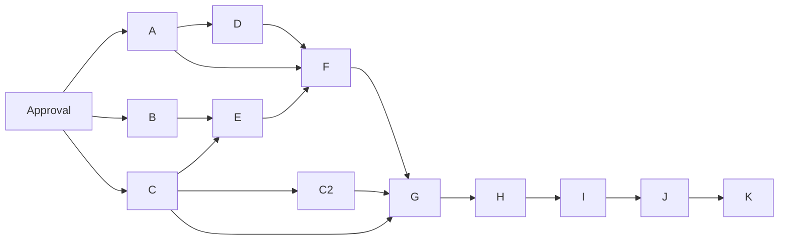

# OTLP export: approval and supervised dogfood plan

- **Status:** Draft
- **Date:** 2026-10-04
- **Symphony Layers:** Configuration, Observability, Coordination, Execution, Integration, Policy
- **Parent:** [#794](https://github.com/hojinzs/github-symphony/issues/794)
- **Contract:** [OTLP Draft design](2026-10-04-otlp-export-design.md)
- **Registration:** Not authorized in this stage. All A–K/C2 identifiers below are local plan identifiers, not GitHub issues or current blocked-by relations.

## Approval and registration boundary

Review the first-release contract before creating any work. Keep #794's `epic`
label and use it only as a tracking parent; workers never implement the parent.
`WORKFLOW.md` already excludes `epic` in tracker pickup policy. Preserve that
filter and test it when the approved child work is scheduled.

After approval, refresh main and existing work/PRs to avoid duplicates, update
the approved Epic release/completion wording, register each scoped child as a
native sub-issue, then register native blocked-by relationships from the graph
below. No such mutation happens in this PR. Do not make #645 or #982 blockers.
Pure orchestrator extraction is a boundary to preserve, not a prerequisite to
rebuild or undo. If a slice crosses package interfaces enough to become L,
split it before registration according to `PROJECT_MANAGE.md`.

Re-query Project #14 field and option IDs at registration; today's Status,
Priority and Size options match `PROJECT_MANAGE.md`, but `.gh-symphony/context.yaml`
is a May snapshot and is not a mutation authority. Set new children to Backlog.
A separate approved scheduling action moves only dependency-ready work to Ready.
In review means waiting for human review; Land is the landing stage after human
approval. Neither successful test execution nor bot authorship grants approval.

## Account and dispatch checks

| Role                    | Evidence today / future requirement                                                                                                                                                                                  |
| ----------------------- | -------------------------------------------------------------------------------------------------------------------------------------------------------------------------------------------------------------------- |
| Documentation PR author | This local host's active `gh` account is `moncher-dev`; publication of this documentation PR is authorized                                                                                                           |
| Future child creator    | `moncher-dev` is a candidate: local auth works and repository assignability API accepts it; recheck credentials/permissions and get account selection before creation                                                |
| Future assignee         | Separate explicit selection; not inferred from creator. #794 currently belongs to `hojinzs`; do not alter parent assignment                                                                                          |
| Dispatch authentication | Inspect the actual project daemon's adapter auth principal at launch. Local `gh` auth does not prove daemon identity; app installation auth can be a different principal                                             |
| `--assigned-only`       | Runtime CLI filter, not persisted setup policy; GitHub adapter resolves current user from dispatch credentials and filters by that login. Verify the chosen bot is that principal and assigned to the approved child |
| Worker publication/auth | Existing host-owned assigned-branch publication and provider tools; do not copy local host credentials into children                                                                                                 |

Before launching dogfood, record authenticated dispatch login, assignee,
creator, project folder/workflow revision and command separately. If principal
resolution or app authentication cannot support assigned-only filtering, stop
scheduling and select a supported credential mode; do not guess a bot identity.
This document creates no issue, assignment, project transition or dogfood run.

## Proposed independent slices

Estimates are single-developer pure implementation hours, excluding review,
testing and CI wait, per `PROJECT_MANAGE.md`. M means package-local source work;
shared docs and test fixtures accompany it without introducing another package's
runtime interface change. Each intermediate deployment keeps export disabled
unless its complete signal contract is present. The feature can be built in
stages without turning partial configuration into a production exporter.

| ID  | Suggested English title                                           | Primary layers               | Priority / Size | Hours | Proposed blockers |
| --- | ----------------------------------------------------------------- | ---------------------------- | --------------- | ----- | ----------------- |
| A   | Parse workflow OTLP policy without activating export              | Configuration                | P1 / M          | 6     | Spec approval     |
| B   | Define SDK-free event normalization and severity                  | Observability                | P2 / M          | 4     | Spec approval     |
| C   | Define authoritative metric projections and support flags         | Observability                | P1 / M          | 6     | Spec approval     |
| C2  | Carry measured token provenance from worker updates               | Execution, Observability     | P1 / M          | 4     | C                 |
| D   | Protect exporter credentials at orchestrator child boundaries     | Execution, Configuration     | P1 / M          | 4     | A                 |
| E   | Offer durable events and committed snapshots without backpressure | Observability, Coordination  | P1 / M          | 5     | B, C              |
| F   | Export structured Logs with bounded OTLP transport                | Observability                | P2 / M          | 10    | A, D, E           |
| G   | Export snapshot Metrics with correct temporality                  | Observability                | P1 / M          | 8     | C, C2, F          |
| H   | Apply exporter lifecycle and safe diagnostics                     | Configuration, Observability | P1 / M          | 5     | G                 |
| I   | Ship CLI diagnostics and verify packaged SDK boundaries           | Observability, Configuration | P2 / M          | 5     | H                 |
| J   | Verify OTLP receipt and faults with Collector blackbox            | Observability, Execution     | P1 / M          | 5     | I                 |
| K   | Publish the approved extension ADR and release usage              | Configuration, Observability | P2 / M          | 3     | J                 |

Total estimate: 65 pure implementation hours, not elapsed delivery time. F adds a
private Logs pipeline behind an internal capability gate; YAML enablement may
validate earlier, but must not start a production partial exporter until G/H
complete the approved Logs+Metrics/lifecycle contract. A–E are independently
useful deployable preparation; F/G use test injection to prove real wire
behavior while the production capability remains off. H activates the complete
pipeline. Reject enabled configuration with a visible unsupported-capability
message in intermediate builds, never silently claim success. Do not rely on a
user-facing feature flag as a substitute for missing failure/security behavior.

The approval node is a human gate, not a fabricated GitHub blocker issue.
Read the following as proposed issue-body sections. Each body must additionally
carry its row's layers, priority, size, estimate, parent and native dependencies
when registered. Acceptance tests reference OT IDs in the design; each child
also runs repository-mandated `pnpm lint`, `pnpm build`, `pnpm test`,
`pnpm typecheck`, and applicable integration checks.

### A — Parse workflow OTLP policy without activating export

**Background:** No typed workflow contract exists for OTLP. Ambient endpoint
values must not accidentally enable external export.

**Proposed Changes:** Add the owned block, strict YAML types, existing whole-value
reference resolution, field precedence and disabled behavior. Expose a resolved
SDK-free configuration with safe diagnostics metadata and auth-name provenance.
This slice does not install SDKs or activate an exporter.

**Affected Files:**

| File                                                                       | Change                                          | Scope                |
| -------------------------------------------------------------------------- | ----------------------------------------------- | -------------------- |
| `packages/core/src/workflow/config.ts`, `parser.ts`, `loader.ts` and tests | Types, resolution, last-known-good behavior     | Configuration        |
| `docs/configuration.md`                                                    | Mark parsed policy as awaiting exporter support | Living documentation |

**Acceptance Criteria:** OT-02/03 configuration tables pass; loader env-digest
behavior and old workflow parsing remain compatible; disabled missing secrets
are harmless; no protocol fallback hides invalid enabled configuration.

### B — Define SDK-free event normalization and severity

**Background:** Legacy event variants use flat and nested fields; export cannot
break local file consumers or couple core to OTel.

**Proposed Changes:** Add pure export normalization/severity contracts with append
context, omission/truncation rules and no transport dependency. Preserve CLI
severity behavior for its later adoption.

**Affected Files:**

| File                                                         | Change                                                 | Scope                |
| ------------------------------------------------------------ | ------------------------------------------------------ | -------------------- |
| `packages/core/src/observability/` and package exports/tests | SDK-free mapping for 27 kinds and unknown-kind default | Observability        |
| `docs/architecture.md`                                       | Core projection ownership                              | Living documentation |

**Acceptance Criteria:** OT-01 mapping fixtures cover severity and context; OT-07
schema unchanged; redacted values only, bounded payload, missing session omitted.

### C — Define authoritative metric projections and support flags

**Background:** Tick summary counts and retained-history totals have different
semantics; Claude zero-initialized usage must not look measured.

**Proposed Changes:** Define metric catalog inputs as a read-only projection,
support-aware Codex totals and lifecycle runtime reuse; keep current persisted
snapshot numeric fields/aggregation unchanged. Add optional measurement
provenance types to the run and worker-channel contracts; legacy records remain
readable and unknown. No exporter counter updates here.

**Affected Files:**

| File                                                                                        | Change                                         | Scope                |
| ------------------------------------------------------------------------------------------- | ---------------------------------------------- | -------------------- |
| `packages/core/src/observability/snapshot-builder.ts`, proposed projection module and tests | Reuse authoritative calculations, support flag | Observability        |
| `packages/core/src/contracts/status-surface.ts`, worker-channel contract and tests          | Optional run/channel measurement provenance    | Observability        |
| `docs/architecture.md`                                                                      | Projection and historical gauge scope          | Living documentation |

**Acceptance Criteria:** OT-06/08 fixtures include repeated updates, valid zero,
absent measurement, mixed runtimes and recovery lifecycle runtime. No tracker
native metric labels; no regression in existing totals.

### C2 — Carry measured token provenance from worker updates

**Background:** Run records do not identify runtime kind or whether zero usage
was actually measured. Current workflow runtime cannot classify historical runs.

**Proposed Changes:** Emit additive channel provenance from the worker after a
valid absolute token update, with runtime kind and a measured flag. Never mark
initial zero counters as measured. Preserve session delta accounting and generic
usage-map rejection; current Claude remains unsupported. E persists these
optional values and recovery retains them using the types from C.

**Affected Files:**

| File                                                    | Change                                                | Scope                    |
| ------------------------------------------------------- | ----------------------------------------------------- | ------------------------ |
| `packages/worker/src/index.ts` and protocol/token tests | Runtime and measurement provenance in channel, no SDK | Execution, Observability |
| `docs/architecture.md`                                  | SDK-free measurement origin                           | Living documentation     |

**Acceptance Criteria:** OT-08 distinguishes valid measured zero from initialized
zero, keeps absolute-update deltas intact, and leaves Claude result usage
uninterpreted. Legacy consumers tolerate additive channel fields. Deployment is
safe before E understands those fields.

### D — Protect exporter credentials at orchestrator child boundaries

**Background:** Project `.env` currently merges into worker execution environment;
auth reference names are not necessarily named OTEL.

**Proposed Changes:** Exclude resolved exporter-owned credential names at existing
final worker/hook construction points, handle shared-name conflicts explicitly,
and preserve agent/tracker credential safety contracts. No new credential broker.

**Affected Files:**

| File                                                                 | Change                                             | Scope                |
| -------------------------------------------------------------------- | -------------------------------------------------- | -------------------- |
| `packages/orchestrator/src/service.ts` and environment/service tests | Final merge exclusion using core policy provenance | Execution            |
| `docs/configuration.md`                                              | Exporter credential ownership                      | Living documentation |

**Acceptance Criteria:** OT-09 verifies arbitrary ref names, `.env` and process
sources with captured worker/hook/custom/Claude/Codex environments; existing
required auth is unaffected; disabled parsing never resolves auth unnecessarily.

### E — Offer durable events and committed snapshots without backpressure

**Background:** Primary persistence is durable; mirror failure is already
best-effort. The awaited onTick callback is not a network export boundary.

**Proposed Changes:** Inject no-op publication callbacks after current durable
append/mirror and status commit; contain callback failures; carry append IDs and
monotonic committed tick identity. Persist optional C2 provenance when available
and retain it on recovery; old workers leave unknown provenance. Measure tick duration around façade execution.

**Affected Files:**

| File                                                            | Change                                      | Scope                       |
| --------------------------------------------------------------- | ------------------------------------------- | --------------------------- |
| `packages/orchestrator/src/fs-store.ts`, `service.ts` and tests | Post-persistence offers and read-only timer | Coordination, Observability |
| `docs/architecture.md`                                          | Local-first order and failure boundary      | Living documentation        |

**Acceptance Criteria:** OT-07 proves byte/integrity/mirror equivalence and no
primary-failure offer; OT-04/12 prove throwing callbacks cannot fail ticks;
extracted decisions remain pure. No runtime SDK in this slice.

### F — Export structured Logs with bounded OTLP transport

**Background:** The append observer has no external implementation. Distribution
and transport retry costs need explicit bounds.

**Proposed Changes:** Add compatible pinned official SDK/protobuf dependencies,
owned providers/resource identity, bounded queue/drain, transient retry/deadline,
warning episodes and local loss counters. Expose only internal injected/test
activation until the complete production pipeline is ready.

**Affected Files:**

| File                                                            | Change                             | Scope                |
| --------------------------------------------------------------- | ---------------------------------- | -------------------- |
| `packages/orchestrator/src/observability/` (proposed) and tests | Transport, resources, Log pipeline | Observability        |
| `packages/orchestrator/package.json`, `pnpm-lock.yaml`          | SDK dependency set                 | Packaging            |
| `docs/architecture.md`                                          | Orchestrator provider ownership    | Living documentation |

**Acceptance Criteria:** OT-01/04/05/12 Logs wire/fault assertions pass; no nested
unbounded retries, global SDK or recursive diagnostics. Production partial
activation rejected. Record dependency baseline and SDK API limitations.

### G — Export snapshot Metrics with correct temporality

**Background:** Repeated snapshots cannot be added as cumulative token deltas;
process outcomes and history gauges require distinct instruments.

**Proposed Changes:** Add the catalog, cumulative process outcomes/histogram and
absolute history gauges, coalesced snapshot cache, once-per-tick accounting and
unsupported-runtime omission. Keep production activation gated until H.

**Affected Files:**

| File                                                 | Change                                     | Scope                |
| ---------------------------------------------------- | ------------------------------------------ | -------------------- |
| `packages/orchestrator/src/observability/` and tests | Metric reader/instruments/projection cache | Observability        |
| `docs/architecture.md`                               | Instrument/temporality mapping             | Living documentation |

**Acceptance Criteria:** OT-01/05/06/08 verify retries do not re-record, restart
UUID resets counters, no historical replay, no issue labels and Claude omission;
no new history scan in collection callback.

### H — Apply exporter lifecycle and safe diagnostics

**Background:** Transport settings must not quietly switch on reload or block
shutdown; operators need applied versus pending settings.

**Proposed Changes:** Activate the complete pipeline only after safe child
construction; wire immutable startup settings, pending reload descriptors,
safe additive status diagnostics and shared bounded shutdown. Keep exporter
health out of coordination lastError.

**Affected Files:**

| File                                                                            | Change                                          | Scope                        |
| ------------------------------------------------------------------------------- | ----------------------------------------------- | ---------------------------- |
| `packages/orchestrator/src/service.ts`, `index.ts`, observability modules/tests | Startup, reload, status projection and shutdown | Configuration, Observability |
| `docs/configuration.md`                                                         | Implemented enable/restart contract             | Living documentation         |

**Acceptance Criteria:** OT-03/10/11/12 cover disabled graph/timers, pending
disable honesty, invalid reload, revert, <=5s flush and secret-free diagnostics.
Status addition uses existing extension mechanism; if a new cross-package
contract is necessary, split it as a prerequisite rather than broadening H.

### I — Ship CLI diagnostics and verify packaged SDK boundaries

**Background:** Private workspace dependencies are bundled into the published
CLI; lazy runtime loading does not prove a correct production install.

**Proposed Changes:** Add doctor validation/bounded enabled probe, status applied
versus pending view, adopt shared severity, audit SDK dependencies/lazy chunks
and worker-entry reachability in packed installs. Measure the design's baseline
startup/RSS/offer thresholds and report packed size separately.

**Affected Files:**

| File                                                                    | Change                                      | Scope                |
| ----------------------------------------------------------------------- | ------------------------------------------- | -------------------- |
| `packages/cli/src/commands/doctor.ts`, `status.ts`, `logs.ts` and tests | Safe diagnostics and compatible severity    | Observability        |
| `packages/cli/tsup.config.ts`, `package.json` if audit requires changes | Publish reachable dependency/chunk boundary | Packaging            |
| `packages/cli/README.md`, `README.md`                                   | Shipped operational usage                   | Living documentation |

**Acceptance Criteria:** OT-03/10/13 pass in clean packed installs; disabled doctor
performs no connection, worker-entry initializes no SDK, diagnostics do not
print credentials. New fields are additive and old logs filters stay identical.

### J — Verify OTLP receipt and faults with Collector blackbox

**Background:** In-process tests cannot prove actual Collector acceptance or
container distribution behavior.

**Proposed Changes:** Add an isolated pinned Collector scenario using existing
standalone-project runner conventions; capture received protobuf-derived
records and metrics plus dispatch/file evidence under healthy and outage cases.
Use existing stub runtime/fixture inputs rather than a real coding-agent token.

**Affected Files:**

| File                                                                      | Change                                         | Scope                |
| ------------------------------------------------------------------------- | ---------------------------------------------- | -------------------- |
| `e2e/` runner, Compose override, Collector config and fixtures (proposed) | Receipt/outage/flush validation                | Integration tests    |
| `AGENT_TEST.md`                                                           | Runnable scenario table and evidence procedure | Living documentation |

**Acceptance Criteria:** OT-14 passes with normal/authenticated receipt and
endpoint interruption; evidence distinguishes gauges/counters and process
incarnation. Preflight status 69 handled exactly as documented, not a daemon
installation task. Operator/CI receipt confirmation required before Epic closure.

### K — Publish the approved extension ADR and release usage

**Background:** Release completion needs an explicit local extension decision
and complete operator guidance, not changes to the upstream spec.

**Proposed Changes:** Publish approved ADR wording from the design candidate,
mark this design Shipped only after actual delivery, reconcile all living docs,
provide token-support/cardinality/endpoint examples, shutdown loss expectations
and separately linked dogfood/Collector evidence. Document later traces/Claude
work outside the fixed Epic closure scope.

**Affected Files:**

| File                                                                                   | Change                                       | Scope         |
| -------------------------------------------------------------------------------------- | -------------------------------------------- | ------------- |
| `docs/adr/` and `docs/README.md`                                                       | Accepted decision only after approval, index | Documentation |
| `docs/configuration.md`, `docs/architecture.md`, `README.md`, `packages/cli/README.md` | Consolidated shipped references              | Documentation |
| Approved design status and relevant changeset                                          | Release record under repository convention   | Documentation |

**Acceptance Criteria:** Required command/config docs agree with shipped code;
upstream spec unchanged; OT-15 and OT-14 evidence independently linked; approved
first-release checklist complete. No new UI/traces/Claude prerequisite or native
sub-issue creation in a documentation worker's scope without explicit approval.

## Dogfood evidence after approval

Start only after account/assignee/filter verification and a dependency-ready
child's explicit Ready scheduling. Preserve each child's own workpad, assigned
branch, PR, unit/integration evidence, human In review and approved Land flow.
The parent stays excluded throughout. Use exporter-disabled preparatory children
first, then the complete pipeline in a supervised project.

For delivery proof record child/PR URL, head SHA, workflow revision, bot assignee,
dispatch auth login, claimed run, tests and human merge decision. For export proof
record the configured redacted endpoints, Collector image/config identity,
received event kinds/resource UUID, metric names and expected sample semantics,
recovery/outage timings and captured output. Bot completion alone is not receipt
proof. Missing worker Docker daemon is the existing status-69 limitation and
must not create an unrelated infrastructure child in #794.
